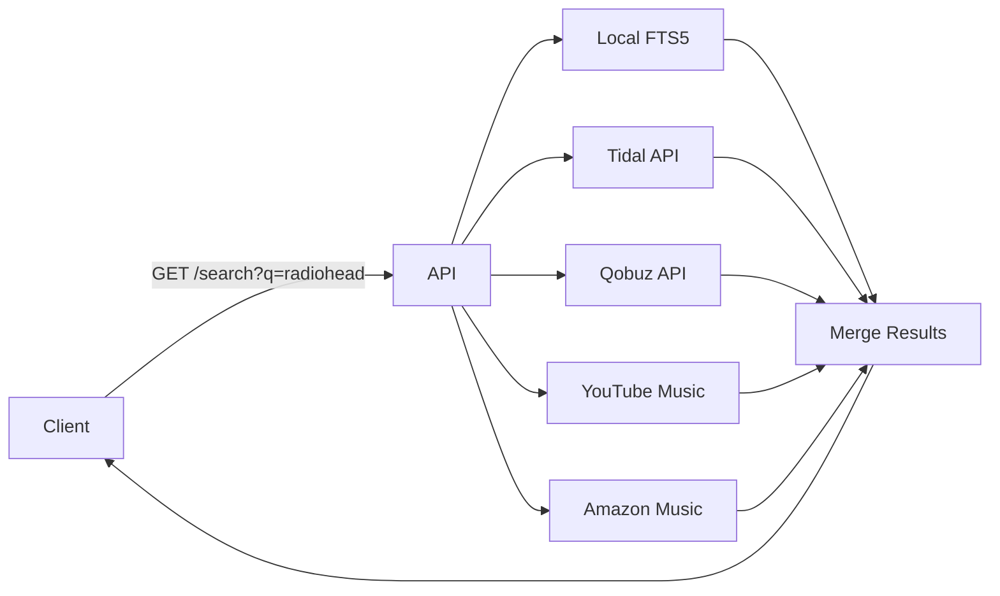
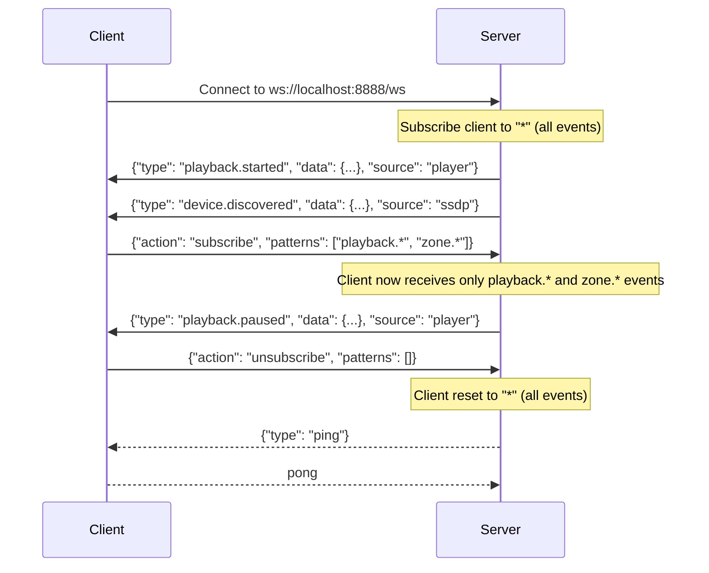
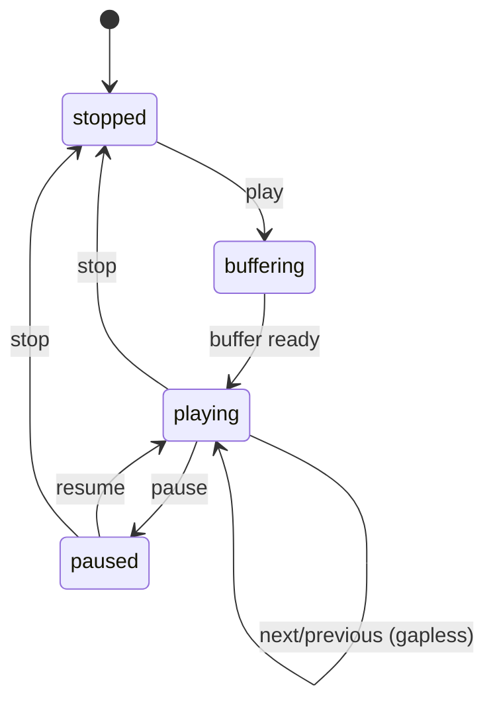

# API Reference

Base URL: `http://localhost:8888/api/v1`

## Authentication

When `TUNE_API_KEY` is configured, all requests (except `/system/health`) must include the API key header:

```
X-API-Key: your-secret-key
```

If the key is missing or invalid, the server returns `401 Unauthorized`.

When `TUNE_API_KEY` is not set (default), no authentication is required.

---

## Library

### GET /library/tracks

List all tracks. Supports pagination.

**Query Parameters:**
- `limit` (int, default 100) — Max results (1-500)
- `offset` (int, default 0) — Skip N results (must be >= 0)

**Response:** `Track[]`

### GET /library/tracks/{id}

Get a single track by ID.

**Response:** `Track`

### PUT /library/tracks/{id}

Update track metadata. For local tracks, also writes changed tags (title, artist) to the audio file.

**Request Body:**
```json
{
    "title": "New Title",
    "track_number": 3
}
```

**Response:** `Track`

### DELETE /library/tracks/{id}

Delete a track.

**Response:** 204 No Content

### GET /library/albums

List all albums.

**Query Parameters:**
- `limit` (int, default 100) — Max results (1-500)
- `offset` (int, default 0) — Skip N results (must be >= 0)

**Response:** `Album[]`

### GET /library/albums/{id}

Get a single album.

**Response:** `Album`

### GET /library/albums/{id}/tracks

Get all tracks in an album, ordered by disc/track number.

**Response:** `Track[]`

### PUT /library/albums/{id}

Update album metadata. When the title is changed, writes the album tag to all local tracks in the album.

**Request Body:**
```json
{
    "title": "Updated Title",
    "year": 1999
}
```

**Response:** `Album`

### DELETE /library/albums/{id}

Delete an album.

**Response:** 204 No Content

### GET /library/artists

List all artists.

**Query Parameters:**
- `limit` (int, default 100) — Max results (1-500)
- `offset` (int, default 0) — Skip N results (must be >= 0)

**Response:** `Artist[]`

### POST /library/artists

Create a new artist.

**Request Body:**
```json
{
    "name": "Artist Name",
    "sort_name": "Name, Artist"
}
```

**Response:** `Artist` (201 Created)

### GET /library/artists/{id}

Get a single artist.

**Response:** `Artist`

### GET /library/artists/{id}/albums

Get all albums by an artist.

**Response:** `Album[]`

### GET /library/artists/{id}/tracks

Get all tracks by an artist.

**Response:** `Track[]`

### PUT /library/artists/{id}

Update artist metadata.

**Request Body:**
```json
{
    "name": "Updated Name",
    "sort_name": "Name, Updated"
}
```

**Response:** `Artist`

### DELETE /library/artists/{id}

Delete an artist.

**Response:** 204 No Content

### GET /library/search

Full-text search across tracks, albums, and artists (local library only).

**Query Parameters:**
- `q` (string, required) — Search query
- `limit` (int, default 50) — Max results per category

**Response:**
```json
{
    "tracks": [Track, ...],
    "albums": [Album, ...],
    "artists": [Artist, ...]
}
```

### GET /library/artwork/{filename}

Serve album artwork from the artwork cache.

**Response:** Image file (JPEG/PNG)

**Errors:**
- `404` — Artwork not found
- `400` — Invalid filename (path traversal attempt)

### GET /library/stats

Library statistics (track, album, artist counts).

**Response:**
```json
{
    "tracks": 7491,
    "albums": 838,
    "artists": 402
}
```

### GET /library/stats/completeness

Metadata completeness statistics — useful for identifying gaps in the library.

**Response:**
```json
{
    "total_albums": 838,
    "albums_without_cover": 42,
    "albums_without_genre": 156,
    "albums_without_year": 23,
    "total_artists": 402,
    "artists_without_image": 380
}
```

### POST /library/albums/merge-duplicates

Detect and merge duplicate albums (same title + artist). Tracks from duplicates are reassigned to the primary album.

**Response:**
```json
{"merged": 12}
```

### POST /library/albums/{album_id}/artwork

Upload album artwork (multipart file upload).

**Request:** `multipart/form-data` with `file` field (image/jpeg, image/png, image/webp)

**Response:** `Album` (with updated `cover_path`)

**Errors:**
- `400` — File is not an image or is empty
- `404` — Album not found

### POST /library/albums/{album_id}/artwork/rescan

Rescan artwork for a single album: tries extracting from embedded track art first, then falls back to MusicBrainz.

**Response:**
```json
{"status": "found", "cover_path": "artwork_cache/abc123.jpg"}
```

or `{"status": "not_found", "cover_path": null}`

### POST /library/artwork/rescan

Batch rescan artwork for all albums without cover art. Runs in the background.

**Response:** `{"status": "started"}` or `{"status": "already_running"}`

**Events emitted:** `LIBRARY_ARTWORK_PROGRESS`, `LIBRARY_ARTWORK_COMPLETED`

### GET /library/browse

List configured music directories and mounted network shares with track counts. Network mount names are resolved from discovered DLNA device names (e.g., "DMP-A8" instead of the raw mount path).

**Response:**
```json
{
    "roots": [
        {"name": "music", "path": "/mnt/music", "track_count": 22469},
        {"name": "DMP-A8", "path": "/mnt/tune-mounts/192.168.1.23_Share", "track_count": 4107}
    ]
}
```

### GET /library/browse/dir

Browse a directory: returns subdirectories and tracks.

**Query Parameters:**
- `path` (string, required) — Absolute path to browse (must be under a configured music directory)

**Response:**
```json
{
    "path": "/home/user/Music/Rock",
    "parent": "/home/user/Music",
    "music_root": "/home/user/Music",
    "directories": [
        {"name": "Pink Floyd", "path": "/home/user/Music/Rock/Pink Floyd", "track_count": 42}
    ],
    "tracks": [Track, ...]
}
```

**Errors:**
- `403` — Path is not under a configured music directory

### Workflows

#### Merge Duplicate Albums

When importing from multiple sources or after rescanning, duplicate albums may appear (same title + artist).

```bash
# 1. Check how many duplicates exist
curl localhost:8888/api/v1/library/stats/completeness

# 2. Merge them (reassigns tracks from duplicates to the primary album)
curl -X POST localhost:8888/api/v1/library/albums/merge-duplicates
# → {"merged": 12}

# 3. Verify
curl localhost:8888/api/v1/library/stats
```

#### Check Library Completeness

Identify metadata gaps to improve browsing experience:

```bash
curl localhost:8888/api/v1/library/stats/completeness
```

Focus areas:
- `albums_without_cover` → use `POST /library/artwork/rescan` to batch-fetch from MusicBrainz
- `albums_without_genre` → update via `PUT /library/albums/{id}` or re-tag source files
- `artists_without_image` → manual upload or future artist image fetching

#### Backup and Restore

```bash
# Create a manual backup
curl -X POST localhost:8888/api/v1/system/backup
# → {"filename": "tune_server_20260302_143000.db", "size": 1234567, "created_at": "..."}

# List available backups
curl localhost:8888/api/v1/system/backups

# Restore from a backup (caution: replaces current DB)
curl -X POST localhost:8888/api/v1/system/restore \
  -H 'Content-Type: application/json' \
  -d '{"filename": "tune_server_20260302_143000.db"}'
```

Automatic backups are created before every schema migration. The server keeps the last 5 backups.

---

## Federated Search

### GET /search

Search across local library and all authenticated streaming services simultaneously.

**Query Parameters:**
- `q` (string, required) — Search query
- `limit` (int, default 20, max 100) — Max results per source
- `sources` (string, optional) — Comma-separated source filter (e.g., `local,tidal,youtube`)

**Response:**
```json
{
    "local": {
        "tracks": [Track, ...],
        "albums": [Album, ...],
        "artists": [Artist, ...]
    },
    "services": {
        "tidal": {
            "tracks": [Track, ...],
            "albums": [Album, ...],
            "artists": [Artist, ...]
        },
        "youtube": {
            "tracks": [Track, ...],
            "albums": [Album, ...],
            "artists": [Artist, ...]
        }
    }
}
```

**Behavior:**
- All sources are queried in parallel via `asyncio.gather`
- If a streaming service fails, its results are omitted (warning logged, other results returned)
- Only authenticated services are queried
- If `sources` is omitted, all available sources are searched



---

## Playlists

### POST /playlists

Create a new playlist.

**Request Body:**
```json
{
    "name": "Favorites",
    "description": "My top tracks"
}
```

**Response:** `Playlist` (201 Created)

**Events emitted:** `PLAYLIST_CREATED`

### GET /playlists

List all playlists.

**Query Parameters:**
- `limit` (int, default 100)
- `offset` (int, default 0)

**Response:** `Playlist[]`

### GET /playlists/{playlist_id}

Get playlist details.

**Response:** `Playlist`

### PUT /playlists/{playlist_id}

Update playlist name/description.

**Request Body:**
```json
{
    "name": "New Name",
    "description": "Updated description"
}
```

**Response:** `Playlist`

**Events emitted:** `PLAYLIST_UPDATED`

### DELETE /playlists/{playlist_id}

Delete a playlist and all its track associations.

**Response:** 204 No Content

**Events emitted:** `PLAYLIST_DELETED`

### GET /playlists/{playlist_id}/tracks

Get all tracks in a playlist, ordered by position.

**Response:** `Track[]`

### POST /playlists/{playlist_id}/tracks

Add tracks to a playlist.

**Request Body:**
```json
{
    "track_ids": [42, 43, 44],
    "position": null
}
```

- `position`: insert position (null = append at end)

**Response:** `Playlist`

**Events emitted:** `PLAYLIST_TRACKS_CHANGED`

### DELETE /playlists/{playlist_id}/tracks/{track_id}

Remove a track from a playlist.

**Response:** 204 No Content

**Events emitted:** `PLAYLIST_TRACKS_CHANGED`

### PUT /playlists/{playlist_id}/tracks

Reorder tracks in a playlist.

**Request Body:**
```json
{
    "track_ids": [44, 42, 43]
}
```

Provide the full ordered list of track IDs.

**Response:** `Playlist`

**Events emitted:** `PLAYLIST_TRACKS_CHANGED`

---

## Devices

### GET /devices

List all discovered network audio devices.

**Response:** `DiscoveredDevice[]`

```json
[
    {
        "id": "uuid:9C41535E-...",
        "name": "DMP-A8",
        "type": "dlna",
        "host": "192.168.1.23",
        "port": 8080,
        "available": true,
        "capabilities": {"dlna": true, "model": "AV Renderer Device"}
    }
]
```

### GET /devices/audio

List local audio output devices (USB DACs, soundcards, etc. via sounddevice).

**Response:**
```json
[
    {"id": 0, "name": "Built-in Audio", "channels": 2, "default": true},
    {"id": 3, "name": "Topping D50s", "channels": 2, "default": false}
]
```

### GET /devices/{device_id}

Get details for a specific discovered network device.

**Response:** `DiscoveredDevice`

---

## Zones

### GET /zones

List all zones.

**Response:** `Zone[]`

### POST /zones

Create a new zone.

**Request Body:**
```json
{
    "name": "Living Room",
    "output_type": "dlna",
    "output_device_id": "uuid:...",
    "sync_delay_ms": 0
}
```

- `output_type`: `"local"`, `"dlna"`, or `"airplay"`
- `output_device_id`: required for `dlna` and `airplay`
- `sync_delay_ms`: per-zone sync offset in ms (default 0, can be negative)

**Response:** `Zone` (201 Created)

**Errors:**
- `503` — Output device not available (discovery pending or device offline)

### GET /zones/{zone_id}

Get zone details.

**Response:** `Zone`

### PUT /zones/{zone_id}

Update a zone (name, sync offset).

**Request Body:**
```json
{"name": "Studio", "sync_delay_ms": 500}
```

All fields are optional.

**Response:** `Zone`

### PATCH /zones/{zone_id}

Partial update (same as PUT, for convenience).

**Request Body:**
```json
{"sync_delay_ms": -200}
```

**Response:** `Zone`

### DELETE /zones/{zone_id}

Delete a zone.

**Response:** 204 No Content

### POST /zones/group

Group zones for multi-room playback.

**Request Body:**
```json
{
    "leader_id": 4,
    "zone_ids": [1, 4]
}
```

**Response:**
```json
{
    "group_id": "e73f13c7",
    "leader_id": 4,
    "zone_ids": [4, 1]
}
```

### DELETE /zones/group/{group_id}

Dissolve a group.

**Response:** 204 No Content

### GET /zones/groups/list

List all active groups.

**Response:**
```json
[
    {
        "group_id": "e73f13c7",
        "leader_id": 4,
        "zone_ids": [4, 1]
    }
]
```

---

## Playback

All playback endpoints operate on a zone. If the zone is in a group, the command affects all zones in the group.

### POST /zones/{zone_id}/play

Start playback. Multiple ways to specify what to play:

**Play a single track:**
```json
{"track_id": 42}
```

**Play multiple tracks:**
```json
{"track_ids": [42, 43, 44]}
```

**Play an album:**
```json
{"album_id": 10}
```

**Play a streaming track:**
```json
{"source": "tidal", "source_id": "12345678"}
```

**Resume (no body or empty body):**
```json
{}
```

**Response:** `Zone`

### POST /zones/{zone_id}/pause

Pause playback.

**Response:** `Zone`

### POST /zones/{zone_id}/resume

Resume from pause.

**Response:** `Zone`

### POST /zones/{zone_id}/stop

Stop playback.

**Response:** `Zone`

### POST /zones/{zone_id}/next

Skip to next track in queue.

**Response:** `Zone`

### POST /zones/{zone_id}/previous

Skip to previous track in queue.

**Response:** `Zone`

### POST /zones/{zone_id}/seek

Seek to position.

**Request Body:**
```json
{"position_ms": 60000}
```

**Response:** `Zone`

### POST /zones/{zone_id}/volume

Set volume.

**Request Body:**
```json
{"volume": 0.7}
```

**Response:** `Zone`

### POST /zones/{zone_id}/shuffle

Toggle shuffle mode.

**Query Parameters:**
- `enabled` (bool, default true)

**Response:** `{"shuffle": true}`

### POST /zones/{zone_id}/repeat

Set repeat mode.

**Query Parameters:**
- `mode` (string, default "off") — `off`, `one`, `all`

**Response:** `{"repeat": "all"}`

### GET /zones/{zone_id}/status

Get current zone state (playback state, current track, position, queue length).

**Response:** `Zone`

### GET /zones/{zone_id}/queue

Get the current play queue.

**Response:**
```json
{
    "tracks": [Track, ...],
    "position": 0,
    "length": 12
}
```

### POST /zones/{zone_id}/queue/add

Add tracks to the queue. Supports local tracks, albums, and streaming service tracks.

**Request Body:**
```json
{
    "track_ids": [42, 43],
    "position": null
}
```

or for streaming:
```json
{
    "source": "tidal",
    "source_id": "12345678"
}
```

- `position`: insert position (null = append at end)

**Response:** `{"queue_length": 14}`

### DELETE /zones/{zone_id}/queue/{index}

Remove a track from the queue by index. If the removed track is currently playing, the next track starts automatically.

**Response:** `{"queue_length": 11}`

### POST /zones/{zone_id}/queue/move

Reorder a track in the queue.

**Request Body:**
```json
{
    "from_position": 3,
    "to_position": 1
}
```

**Response:** `{"queue_length": 12}`

### POST /zones/{zone_id}/queue/jump

Jump to a specific queue position.

**Request Body:**
```json
{
    "position": 5
}
```

**Response:** `Zone`

### POST /zones/{zone_id}/queue/clear

Clear the entire queue and stop playback.

**Response:** `{"queue_length": 0}`

---

## Streaming Services

### GET /streaming/services

List all registered streaming services and their authentication status.

**Response:** `dict[str, StreamingServiceStatus]`
```json
{
    "tidal": {"enabled": true, "authenticated": true},
    "qobuz": {"enabled": true, "authenticated": false},
    "youtube": {"enabled": false, "authenticated": false},
    "amazon": {"enabled": true, "authenticated": true},
    "spotify": {"enabled": true, "authenticated": false},
    "deezer": {"enabled": false, "authenticated": false}
}
```

### GET /streaming/{service_name}/status

Get detailed status for a specific streaming service.

**Response:**
```json
{
    "name": "tidal",
    "authenticated": true,
    "quality": "HI_RES_LOSSLESS"
}
```

### POST /streaming/{service_name}/auth

Initiate authentication for a streaming service. The flow varies by service (OAuth device flow for Tidal/YouTube/Amazon, PKCE OAuth for Spotify, OAuth 2.0 for Deezer, credentials for Qobuz).

**Request Body (Qobuz):**
```json
{
    "username": "user@example.com",
    "password": "secret"
}
```

**Response:** `StreamingAuthResponse` — may include `verification_url` and `user_code` for device code OAuth flows

### POST /streaming/{service_name}/disconnect

Disconnect from a streaming service (clears stored auth tokens).

**Response:** `{"disconnected": true}`

### GET /streaming/{service_name}/featured/sections

Get available featured content sections (e.g., "new-releases", "editor-picks").

**Response:**
```json
[
    {"id": "new-releases", "title": "New Releases"},
    {"id": "editor-picks", "title": "Editor's Picks"},
    {"id": "best-sellers", "title": "Best Sellers"}
]
```

### GET /streaming/{service_name}/featured/{section}

Get featured albums for a specific section.

**Query Parameters:**
- `limit` (int, default 20, max 100)

**Response:** `Album[]`

### GET /streaming/{service_name}/search

Search a specific streaming service catalog.

**Query Parameters:**
- `q` (string, required) — Search query
- `limit` (int, default 20)

**Response:** `SearchResult`

### GET /streaming/{service_name}/tracks/{track_id}

Get a track from a streaming service.

**Response:** `Track`

### GET /streaming/{service_name}/albums/{album_id}

Get an album from a streaming service.

**Response:** `Album`

### GET /streaming/{service_name}/albums/{album_id}/tracks

Get all tracks in a streaming service album.

**Response:** `Track[]`

### GET /streaming/{service_name}/artists/{artist_id}

Get an artist from a streaming service.

**Response:** `Artist`

### GET /streaming/{service_name}/artists/{artist_id}/albums

Get all albums by an artist from a streaming service.

**Response:** `Album[]`

### GET /streaming/{service_name}/artists/{artist_id}/tracks

Get all tracks by an artist from a streaming service.

**Response:** `Track[]`

---

## Network

### GET /network/shares

List discovered SMB/NFS shares on the local network (via mDNS).

**Response:** `NetworkShare[]`

### GET /network/shares/{share_id}/list

Enumerate available shares/exports on a discovered host.

**Response:**
```json
{
    "share_id": "192.168.1.10",
    "shares": ["music", "media", "backup"]
}
```

### GET /network/scan-host

Scan a specific host for available shares (without relying on mDNS discovery).

**Query Parameters:**
- `host` (string, required) — IP or hostname to scan
- `protocol` (string, default "smb") — `smb` or `nfs`

**Response:**
```json
{
    "host": "192.168.1.10",
    "protocol": "smb",
    "shares": ["music", "media"]
}
```

### GET /network/media-servers

List discovered DLNA MediaServer devices on the network.

**Response:** `DiscoveredMediaServer[]`

### GET /network/media-servers/{server_id}/browse

Browse a DLNA MediaServer's ContentDirectory.

**Query Parameters:**
- `object_id` (string, default "0") — ContentDirectory object ID ("0" = root)
- `start` (int, default 0) — Starting index for pagination
- `count` (int, default 100, max 500) — Number of items to return

**Response:** `MediaServerBrowseResult` (containers and items with metadata)

### GET /network/media-servers/{server_id}/item/{item_id}/stream-url

Get the direct stream URL for a specific item on a DLNA MediaServer.

**Response:**
```json
{"stream_url": "http://192.168.1.10:8200/MediaItems/123.flac"}
```

### GET /network/mounts

List all configured network mounts.

**Response:** `MountInfo[]`

### POST /network/mounts

Mount a network share (SMB or NFS) to a local directory.

**Request Body:**
```json
{
    "host": "192.168.1.10",
    "share": "music",
    "protocol": "smb",
    "username": "user",
    "password": "pass"
}
```

**Response:** `MountInfo`

### DELETE /network/mounts/{mount_id}

Unmount and remove a network share.

**Response:** 204 No Content

### POST /network/mounts/{mount_id}/remount

Re-mount an existing network share (e.g., after network reconnection).

**Response:** `MountInfo`

---

## Radios

### POST /radios

Create a radio station.

**Request Body:**
```json
{
    "name": "FIP",
    "stream_url": "https://icecast.radiofrance.fr/fip-hifi.aac",
    "genre": "Éclectique",
    "codec": "aac",
    "country": "FR"
}
```

**Response:** `RadioStation` (201 Created)

**Events emitted:** `RADIO_CREATED`

### GET /radios

List radio stations.

**Query Parameters:**
- `genre` (string, optional) — Filter by genre
- `favorite` (bool, optional) — Filter favorites only
- `limit` (int, default 100)
- `offset` (int, default 0)

**Response:** `RadioStation[]`

### GET /radios/{id}

Get a radio station.

**Response:** `RadioStation`

### PUT /radios/{id}

Update a radio station (partial update).

**Request Body:**
```json
{
    "name": "FIP Jazz",
    "genre": "Jazz"
}
```

**Response:** `RadioStation`

**Events emitted:** `RADIO_UPDATED`

### DELETE /radios/{id}

Delete a radio station.

**Response:** 204 No Content

**Events emitted:** `RADIO_DELETED`

### POST /radios/{id}/artwork

Upload radio station cover art (multipart file upload).

**Request:** `multipart/form-data` with `file` field (image/jpeg, image/png, image/webp)

**Response:** `RadioStation` (with updated `logo_url`)

**Events emitted:** `RADIO_UPDATED`

### POST /radios/import

Import radio stations from an M3U or PLS playlist file.

**Request:** `multipart/form-data` with `file` field (.m3u, .m3u8, .pls)

**Response:**
```json
{
    "imported": 5,
    "skipped": 2,
    "errors": []
}
```

Duplicate URLs are skipped (matched by `stream_url`).

### POST /radios/{id}/play/{zone_id}

Play a radio station on a zone. The station is converted to a `Track` with `source=radio` and `duration_ms=0` (infinite stream).

**Response:** `Zone`

---

## System

### GET /system/health

Health check. Exempt from API key authentication.

**Response:**
```json
{"status": "ok"}
```

### GET /system/config

Get current server configuration (sensitive values redacted).

**Response:**
```json
{
    "music_dirs": ["~/Music"],
    "api_host": "0.0.0.0",
    "api_port": 8888,
    "stream_port": 8080,
    "scan_on_startup": true,
    "watch_filesystem": true,
    "tidal_enabled": true,
    "qobuz_enabled": false,
    "youtube_enabled": true,
    "amazon_music_enabled": false,
    "discovery_enabled": true,
    "ws_heartbeat_interval": 30
}
```

### POST /system/scan

Trigger a library scan.

**Query Parameters:**
- `path` (string, optional) — Scan a single configured music directory instead of all

**Response:**
```json
{"status": "scan_started", "music_dirs": ["/mnt/music"]}
```

**Errors:**
- `400` — Path is not a configured music directory
- `409` — Scan already in progress

### GET /system/scan/status

Get library scan status.

**Response:**
```json
{
    "status": "scanning",
    "progress": 0.45,
    "files_scanned": 3200,
    "files_total": 7100,
    "tracks_added": 150,
    "tracks_updated": 23,
    "tracks_removed": 5
}
```

When idle:
```json
{
    "status": "idle",
    "progress": 1.0,
    "last_scan_at": "2026-02-13T10:30:00"
}
```

### GET /system/stats

System statistics.

**Response:**
```json
{
    "tracks": 7491,
    "albums": 838,
    "artists": 402,
    "zones": 3,
    "devices": 5
}
```

---

## WebSocket

### WS /ws

Real-time event stream. Connect with any WebSocket client.

**Connection flow:**



**Event message format:**
```json
{
    "type": "playback.started",
    "data": {"zone_id": 1, "track_id": 42, "track_title": "La Nuit Je Mens"},
    "source": "player"
}
```

**Subscribe to specific event patterns:**
```json
{"action": "subscribe", "patterns": ["playback.*", "playlist.*"]}
```

Patterns use fnmatch syntax (shell-style wildcards):
- `"*"` — All events
- `"playback.*"` — All playback events
- `"playlist.*"` — All playlist events
- `"zone.*"` — All zone events
- `"playback.position"` — Only position updates

**Unsubscribe (reset to all events):**
```json
{"action": "unsubscribe", "patterns": []}
```

**Heartbeat:**
- Server sends `{"type": "ping"}` every `WS_HEARTBEAT_INTERVAL` seconds (default 30)
- Client should respond with `pong` (text message)
- Set `TUNE_WS_HEARTBEAT_INTERVAL=0` to disable

See [Event Bus](event-bus.md) for the full list of 28 event types.

---

## Data Models

### Track

```json
{
    "id": 2212,
    "title": "La Nuit Je Mens",
    "album_id": 236,
    "album_title": "Fantaisie Militaire",
    "artist_id": 89,
    "artist_name": "Alain Bashung",
    "disc_number": 1,
    "track_number": 2,
    "duration_ms": 264733,
    "file_path": "/Users/bertrand/Music/.../02 La Nuit Je Mens.m4a",
    "format": "aac",
    "sample_rate": 44100,
    "bit_depth": 16,
    "channels": 2,
    "source": "local",
    "source_id": null
}
```

### Album

```json
{
    "id": 236,
    "title": "Fantaisie Militaire",
    "artist_id": 89,
    "artist_name": "Alain Bashung",
    "year": 1998,
    "genre": "Chanson Francaise",
    "disc_count": 1,
    "track_count": 12,
    "cover_path": "artwork_cache/24363c6426bd28423705720120d41b7f.jpg",
    "source": "local",
    "source_id": null
}
```

### Artist

```json
{
    "id": 89,
    "name": "Alain Bashung",
    "sort_name": null,
    "musicbrainz_id": null,
    "discogs_id": null,
    "bio": null,
    "image_path": null
}
```

### Zone

```json
{
    "id": 4,
    "name": "EverSolo DMP-A8",
    "output_type": "dlna",
    "output_device_id": "uuid:9C41535E-...",
    "volume": 0.5,
    "group_id": "e73f13c7",
    "sync_delay_ms": 0,
    "state": "playing",
    "current_track": {Track},
    "position_ms": 42000,
    "queue_length": 12
}
```

### Playlist

```json
{
    "id": 1,
    "name": "Favorites",
    "description": "My top tracks",
    "track_count": 42
}
```

### RadioStation

```json
{
    "id": 1,
    "name": "FIP",
    "stream_url": "https://icecast.radiofrance.fr/fip-hifi.aac",
    "logo_url": "artwork_cache/abc123.jpg",
    "genre": "Éclectique",
    "tags": null,
    "codec": "aac",
    "country": "FR",
    "homepage_url": null,
    "favorite": true
}
```

### Playback States


