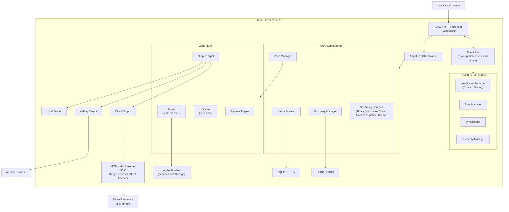
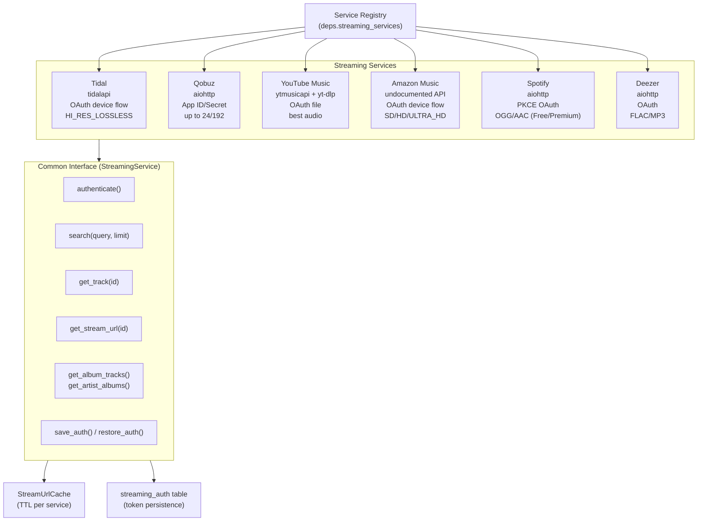
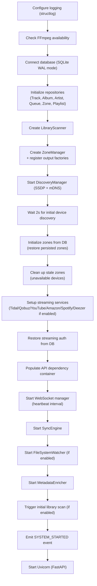
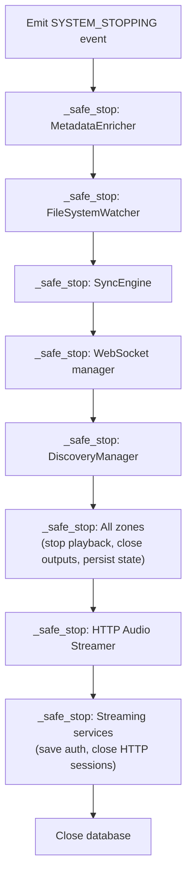
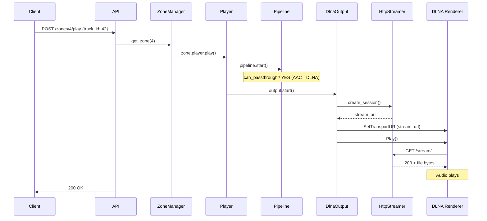
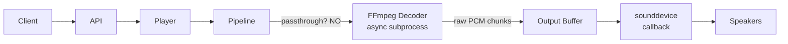
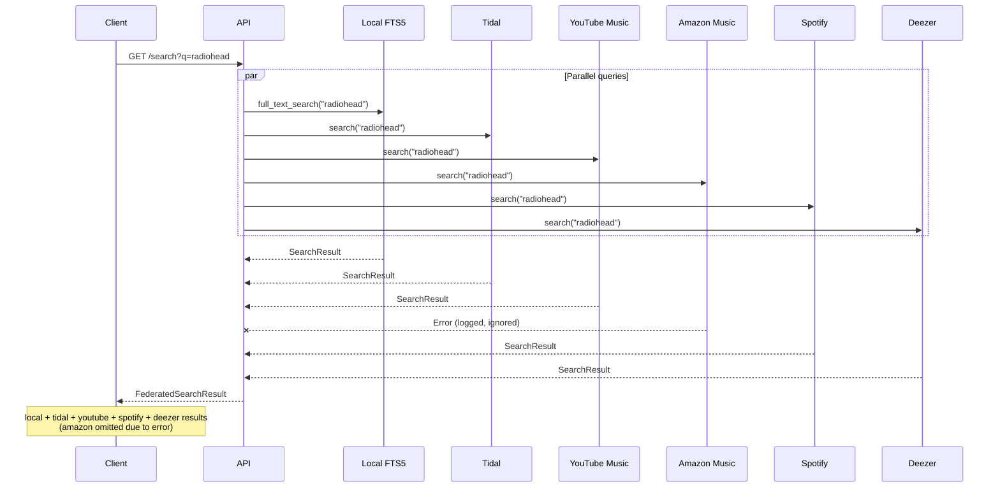
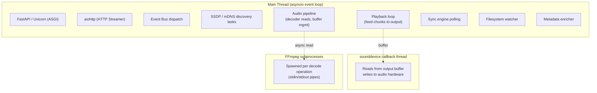
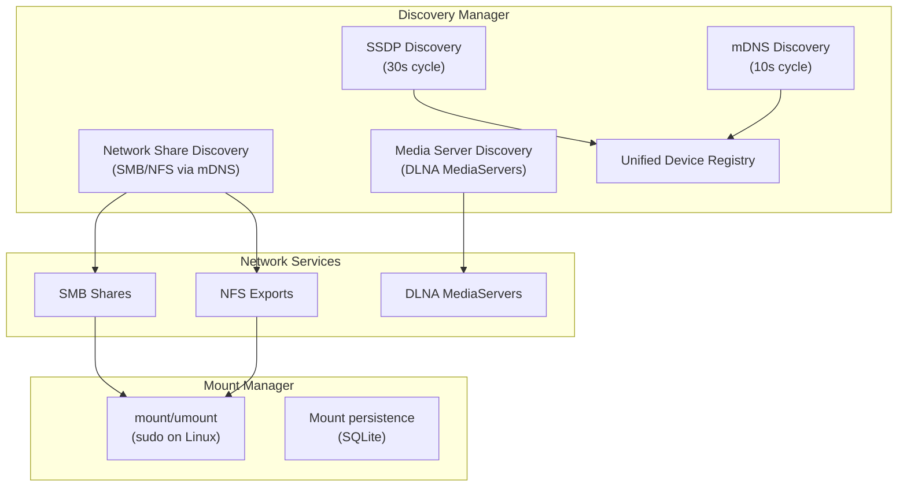
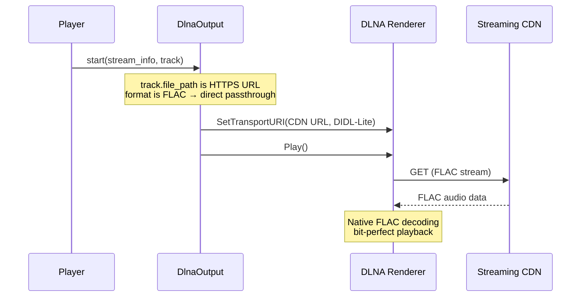

# Architecture Overview

## Design Principles

1. **Async-first** — Single asyncio event loop, no threads except where forced by libraries (sounddevice callback)
2. **Event-driven** — Loose coupling via pub/sub event bus; components communicate through events, not direct calls
3. **Output-agnostic** — All outputs implement a common `OutputTarget` protocol; the player doesn't know if it's feeding DLNA, AirPlay, or a local soundcard
4. **Bit-perfect when possible** — Never upsample; passthrough original file bytes when the output supports the source format
5. **Fail gracefully** — Network devices appear and disappear; the server adapts without crashing

## System Diagram

## Streaming Services

## Component Lifecycle

### Startup Sequence (`TuneServer.start()`)

### Shutdown Sequence (`TuneServer.stop()`)

Each component is stopped with `_safe_stop(coro, name, timeout)` to prevent one hung component from blocking the entire shutdown.

## Request Flow Examples

### Play a Track on DLNA

### Play a Track on Local Output

### Federated Search

## Thread Model

## Network Discovery & Shares

Network shares discovered via mDNS can be mounted to local directories and added to `TUNE_MUSIC_DIRS` for library scanning. The mount manager handles `mount`/`umount` system calls (via `sudo` on Linux, with sudoers configuration).

DLNA MediaServers are browsable via the `/network/media-servers` API — their ContentDirectory can be navigated and individual items can be streamed.

## Metadata Management

The library supports full metadata editing and artwork management:

- **Metadata editing**: PUT endpoints for tracks, albums, and artists update fields in SQLite
- **Tag writing**: changes to title, artist, and album are written back to audio files via mutagen (FLAC, MP3/ID3, M4A/MP4, OGG Vorbis). Runs in a thread pool (`asyncio.to_thread`) to avoid blocking the event loop
- **Artwork pipeline**: embedded art extraction → MusicBrainz fallback → manual upload
- **Duplicate detection**: album merge-duplicates endpoint identifies same title+artist albums and consolidates tracks
- **Completeness stats**: tracks albums/artists missing cover art, genre, year, or images

## DLNA Direct URL Passthrough

For streaming service tracks (Qobuz, Tidal) played on DLNA renderers, the server can bypass the local audio pipeline entirely:

This avoids the decode→PCM→WAV pipeline that can cause audio artifacts with 24-bit content, since WAV PCM format code 1 is only specified for up to 16-bit audio.

Supported direct formats: FLAC, MP3, AAC. Falls back to the standard pipeline for local files, unsupported formats, or non-DLNA outputs.

## Web Client

The server can serve a built Svelte SPA (Single Page Application) when `TUNE_WEB_DIR` is configured:

- Static assets with Vite content-hashed filenames are served with long cache headers
- All non-API, non-asset routes fall back to `index.html` (SPA routing)
- Both API and UI are served from the same `:8888` port
- The web client connects via WebSocket for real-time playback state updates

Build and embed: `TUNE_WEB_DIR=/path/to/tune-web-client/dist python -m tune_server`

## Error Handling Strategy

| Scenario | Behavior |
|----------|----------|
| DLNA device disappears mid-playback | HTTP connection drops, stream session cleaned up, zone remains (device marked unavailable) |
| FFmpeg decode error | Pipeline stops, player emits PLAYBACK_ERROR, auto-skips to next track |
| Database error | Logged, operation fails gracefully, server continues |
| Network discovery fails | Logged, retried on next scan cycle (30s for SSDP, 10s for mDNS) |
| Zone creation with unavailable device | Factory waits up to 15s for discovery, then returns 503 |
| Server restart with stale zones | Zones with unavailable outputs are cleaned from DB |
| Client disconnects from HTTP stream | `ClientConnectionResetError` caught silently |
| Streaming service error during federated search | Logged as warning, results from other services still returned |
| Streaming URL resolution timeout | PLAYBACK_ERROR emitted, auto-skip to next track |
| 3 consecutive playback failures | Playback stops entirely (prevents infinite skip loop) |
| AirPlay auth error | Retry with backoff, zone marked degraded if persistent |
| WebSocket client disconnect during broadcast | Connection removed from set, broadcast continues to other clients |
