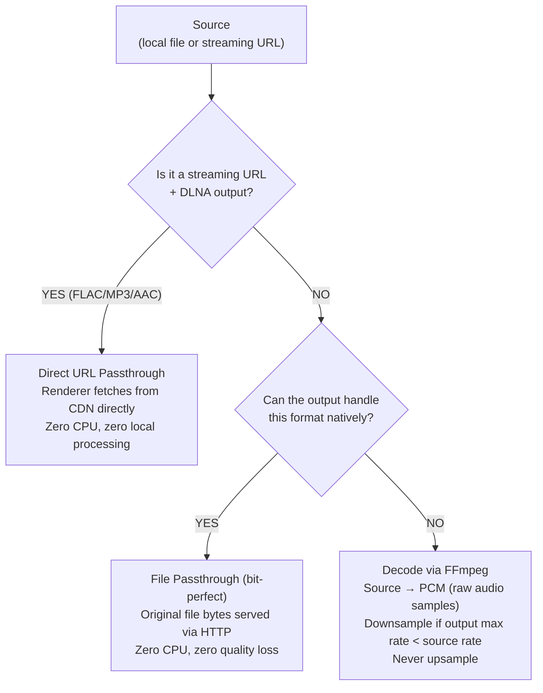
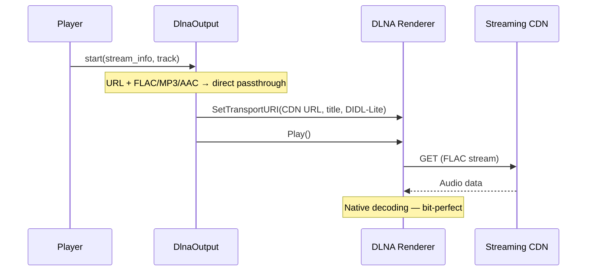
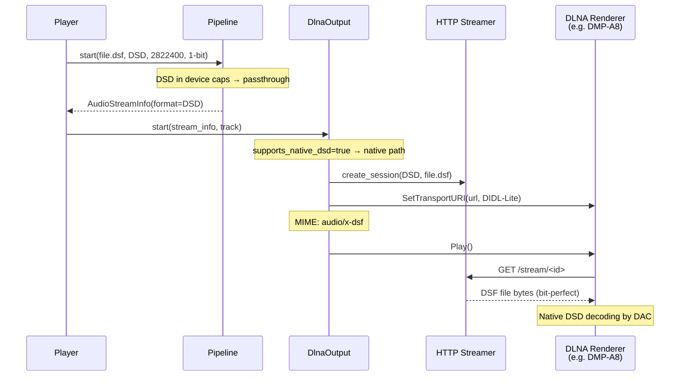
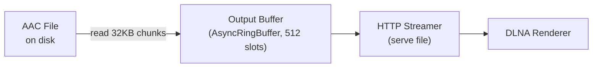
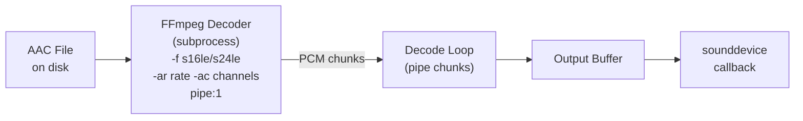
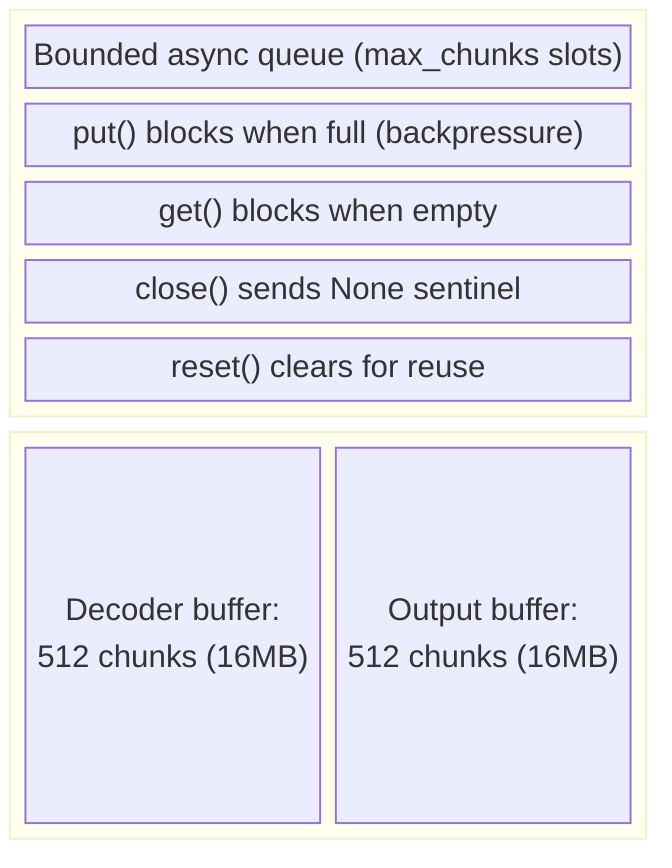
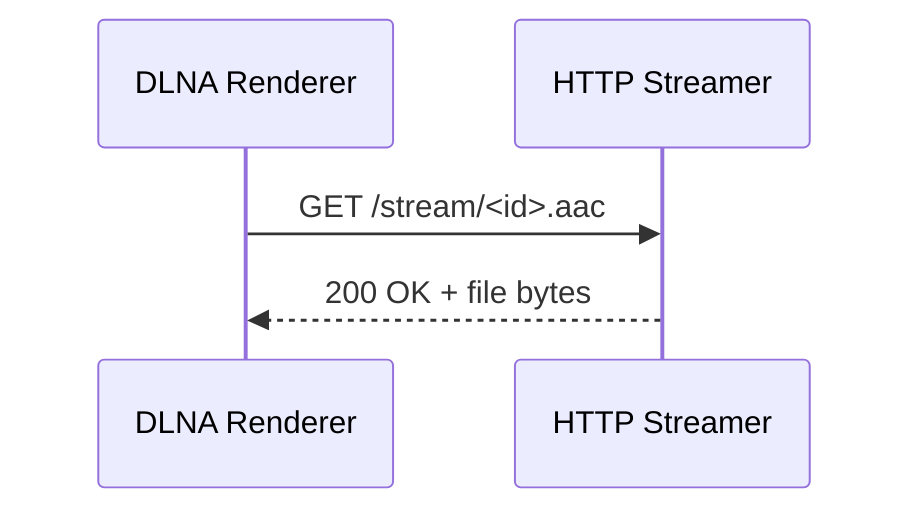
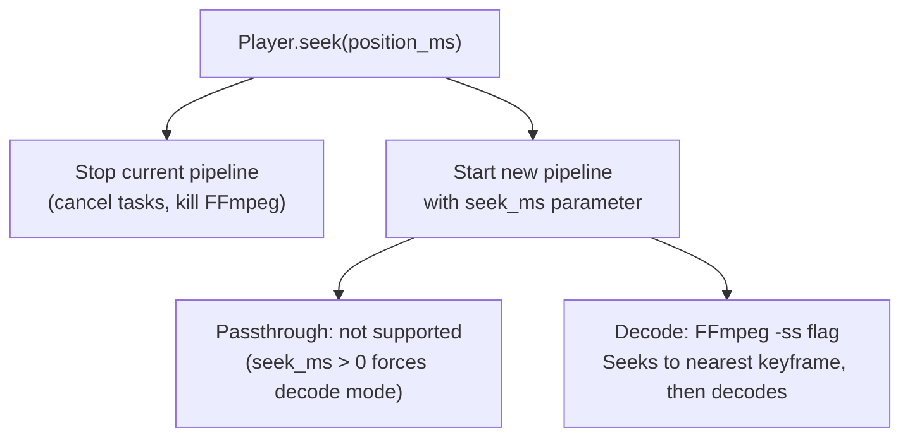
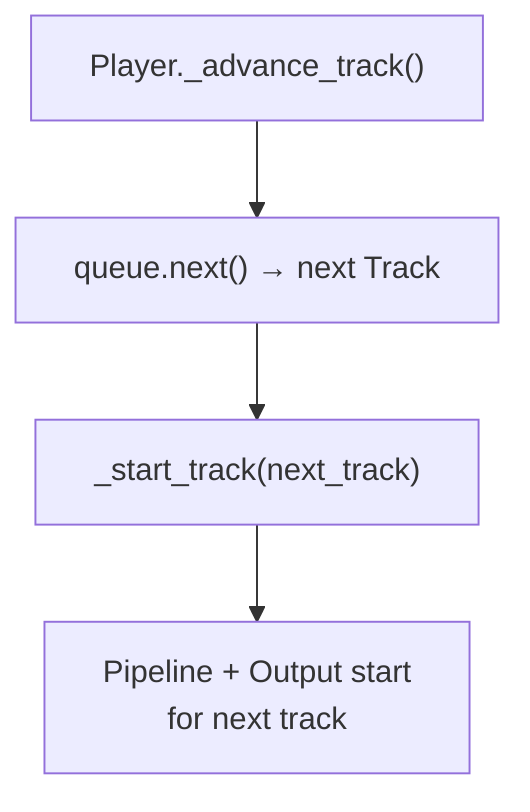

# Audio Pipeline

## Overview

The audio pipeline determines how audio data flows from a source file to an output device. The key decision is **passthrough vs. decode**.

## Decision Flow



## Direct URL Passthrough (DLNA + Streaming)

When a DLNA renderer plays a streaming service track (Qobuz, Tidal), the server passes the CDN URL directly to the renderer. No local pipeline, no FFmpeg, no HTTP streamer — the renderer fetches and decodes natively.



### Why?

The previous approach decoded FLAC to PCM 24-bit then re-wrapped as WAV. But WAV format code 1 (PCM) is only specified for up to 16-bit audio — 24-bit requires WAVE_FORMAT_EXTENSIBLE. Most DLNA renderers misinterpreted the 24-bit WAV, producing loud noise.

Direct URL passthrough solves this by letting the renderer handle the original FLAC natively.

### Supported formats

FLAC, MP3, AAC — these are universally supported by DLNA renderers.

### Track-end detection

Without a local pipeline, the server monitors track position via a background task (`_direct_url_monitor`) and auto-advances to the next track based on `track.duration_ms`.

### DIDL-Lite metadata

The metadata sent with `SetTransportURI` includes:

| Element | Value |
|---------|-------|
| `dc:title` | Track title |
| `dc:creator` | Artist |
| `upnp:album` | Album title |
| `upnp:albumArtURI` | Cover art URL (e.g., Qobuz CDN) |
| `res@duration` | Track duration (`H:MM:SS.mmm`) |
| `res@sampleFrequency` | Sample rate |
| `res@bitsPerSample` | Bit depth |
| `res@nrAudioChannels` | Channel count |

---

## Native DSD Passthrough (DLNA)

When a DLNA renderer supports native DSD (DSF/DFF), the server sends the file directly without transcoding. The renderer's DAC handles DSD→analog conversion natively.



### DSD Detection

Two-layer detection:

1. **GetProtocolInfo** — The server queries the renderer's `SinkProtocolInfo` for DSD MIME types (`audio/x-dsf`, `audio/x-dff`, `application/x-dsd`)
2. **Device heuristic** — If `GetProtocolInfo` returns empty (common with audiophile devices), the server checks the device name/model against known DSD-capable patterns (Eversolo, Lumin, Naim, Cambridge Audio, etc.)

### DSD Transcoding Fallback

When the renderer doesn't support native DSD:

- **Sample rate**: 44.1kHz family (`_best_dsd_rate()`) — 176.4kHz preferred, avoids SRC artifacts from mixing 44.1k and 48k families
- **Bit depth**: 24-bit (maximum dynamic range from 1-bit DSD)
- **Output format**: WAV (PCM) — FLAC pipe has `total_samples=0` which breaks some renderers
- **Buffer**: 32KB chunks, 512-slot ring buffer

### MIME Types

| Extension | MIME Type |
|-----------|-----------|
| `.dsf` | `audio/x-dsf` |
| `.dff` | `audio/x-dff` |

---

## Passthrough Mode

Used when the output supports the source format. Example: DLNA renderer playing an AAC file.



- File is read in 32KB chunks via `asyncio.to_thread(f.read)`
- Chunks are pushed to `AsyncRingBuffer` (512 slots)
- For DLNA: the HTTP streamer serves the file directly with Range support
- `AudioStreamInfo` includes `file_size` for Content-Length headers

### Format Capabilities

DLNA capabilities are built **per device** based on protocol info and device detection:

```python
# Base formats for all DLNA renderers
base_formats = {FLAC, WAV, MP3, AAC}

# DSD added when renderer supports native DSF/DFF
if supports_native_dsd:
    formats.add(DSD)

AudioCapabilities(
    formats=formats,
    max_sample_rate=192000,
    max_bit_depth=24,
    supports_gapless=True,
)
```

```python
LOCAL_CAPABILITIES = AudioCapabilities(
    formats={WAV},  # sounddevice only accepts raw PCM
    max_sample_rate=384000,
    max_bit_depth=32,
    supports_gapless=True,
)
```

## Decode Mode

Used when the output cannot handle the source format. Example: local soundcard playing an AAC file.



### FFmpeg Decoder

The decoder runs FFmpeg as an async subprocess:

```
ffmpeg -hide_banner -loglevel error [-ss <seek>] \
  -i <input_file> \
  -f s16le -ar 44100 -ac 2 -acodec pcm_s16le \
  pipe:1
```

- Output format: raw PCM (`s16le`, `s24le`, or `s32le`)
- Sample rate: min(source_rate, output_max_rate) — never upsamples
- Bit depth: min(source_depth, output_max_depth)
- Seek: `-ss` flag for FFmpeg input seeking (fast, uses keyframes)

### PCM Format Selection

| Source Bit Depth | PCM Output Format |
|-----------------|-------------------|
| ≤ 16 bits       | `s16le` (2 bytes/sample) |
| 17-24 bits      | `s24le` (3 bytes/sample) |
| > 24 bits       | `s32le` (4 bytes/sample) |

## Buffer Architecture



The buffer provides backpressure: if the output can't consume fast enough, the decoder slows down naturally. If the decoder is slower than real-time (shouldn't happen for local files), the output will briefly block.

## DLNA Streaming Details

For DLNA outputs, the HTTP Audio Streamer serves audio to the renderer:

### File Passthrough (most common)



Supports:
- `Content-Length` header (renderer knows total size)
- `Range` requests (206 Partial Content for seeking)
- `Accept-Ranges: bytes`
- DLNA headers: `transferMode.dlna.org: Streaming`

### Streaming Mode (for transcoded audio)

When audio is transcoded (PCM from decoder → re-encoded for DLNA), chunks are pushed to the stream session queue and served as a chunked response. No Content-Length, no Range support.

## Seek Implementation



Note: seeking in passthrough mode is not possible (can't serve partial file from arbitrary position in a compressed format). The pipeline automatically falls back to decode mode when `seek_ms > 0`.

## Gapless Playback

### Local Output
Pre-decode the next track while the current track plays. When the current track ends, the next track's PCM is already buffered.

### DLNA Output
Use `SetNextAVTransportURI` to tell the renderer what to play next. The renderer handles the transition internally.


