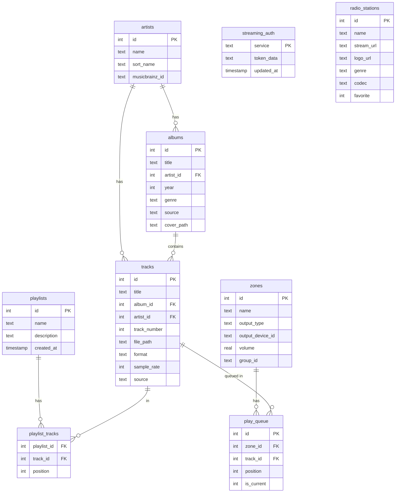

# Database Schema

## Overview

SQLite database with WAL mode for concurrent reads, FTS5 virtual tables for full-text search, and automatic sync triggers.

## Configuration

- **Engine**: SQLite 3 via `aiosqlite`
- **WAL mode**: Enabled for concurrent read access while writing
- **Foreign keys**: Enforced (`PRAGMA foreign_keys = ON`)
- **Journal mode**: WAL (`PRAGMA journal_mode = WAL`)

## Entity Relationships



## Tables

### artists

| Column | Type | Description |
|--------|------|-------------|
| `id` | INTEGER PK | Auto-increment |
| `name` | TEXT NOT NULL | Artist name |
| `sort_name` | TEXT | For alphabetical sorting (e.g., "Beatles, The") |
| `musicbrainz_id` | TEXT | MusicBrainz MBID |
| `discogs_id` | TEXT | Discogs artist ID |
| `bio` | TEXT | Artist biography |
| `image_path` | TEXT | Path to artist image |
| `created_at` | TIMESTAMP | Creation time |
| `updated_at` | TIMESTAMP | Last modification time |

### albums

| Column | Type | Description |
|--------|------|-------------|
| `id` | INTEGER PK | Auto-increment |
| `title` | TEXT NOT NULL | Album title |
| `artist_id` | INTEGER FK | → artists.id |
| `year` | INTEGER | Release year |
| `genre` | TEXT | Primary genre |
| `disc_count` | INTEGER | Number of discs (default 1) |
| `track_count` | INTEGER | Number of tracks (default 0) |
| `cover_path` | TEXT | Path to cover art file |
| `source` | TEXT | `local`, `tidal`, `qobuz`, `youtube`, or `amazon` (default `local`) |
| `source_id` | TEXT | External service album ID |
| `created_at` | TIMESTAMP | Creation time |
| `updated_at` | TIMESTAMP | Last modification time |

### tracks

| Column | Type | Description |
|--------|------|-------------|
| `id` | INTEGER PK | Auto-increment |
| `title` | TEXT NOT NULL | Track title |
| `album_id` | INTEGER FK | → albums.id |
| `artist_id` | INTEGER FK | → artists.id |
| `disc_number` | INTEGER | Disc number (default 1) |
| `track_number` | INTEGER | Track number (default 0) |
| `duration_ms` | INTEGER | Duration in milliseconds |
| `file_path` | TEXT UNIQUE | Absolute path to audio file |
| `format` | TEXT | Audio format (flac, aac, mp3, alac, ogg, opus, dsd, aiff, wma, wav) |
| `sample_rate` | INTEGER | Sample rate in Hz |
| `bit_depth` | INTEGER | Bits per sample |
| `channels` | INTEGER | Number of audio channels (default 2) |
| `file_mtime` | REAL | File modification time (for scan optimization) |
| `audio_hash` | TEXT | Audio content hash for duplicate detection |
| `source` | TEXT | `local`, `tidal`, `qobuz`, `youtube`, or `amazon` |
| `source_id` | TEXT | External service track ID |
| `created_at` | TIMESTAMP | Creation time |
| `updated_at` | TIMESTAMP | Last modification time |

### playlists

| Column | Type | Description |
|--------|------|-------------|
| `id` | INTEGER PK | Auto-increment |
| `name` | TEXT NOT NULL | Playlist name |
| `description` | TEXT | Playlist description |
| `created_at` | TIMESTAMP | Creation time |
| `updated_at` | TIMESTAMP | Last modification time |

### playlist_tracks

| Column | Type | Description |
|--------|------|-------------|
| `id` | INTEGER PK | Auto-increment |
| `playlist_id` | INTEGER FK | → playlists.id (CASCADE delete) |
| `track_id` | INTEGER FK | → tracks.id (CASCADE delete) |
| `position` | INTEGER | Order in playlist |

### zones

| Column | Type | Description |
|--------|------|-------------|
| `id` | INTEGER PK | Auto-increment |
| `name` | TEXT NOT NULL | Zone display name |
| `output_type` | TEXT NOT NULL | `local`, `dlna`, or `airplay` |
| `output_device_id` | TEXT | Device identifier (USN for DLNA, MAC for AirPlay) |
| `volume` | REAL | Volume level 0.0-1.0 (default 0.5) |
| `group_id` | TEXT | Multi-room group identifier |

### play_queue

| Column | Type | Description |
|--------|------|-------------|
| `id` | INTEGER PK | Auto-increment |
| `zone_id` | INTEGER FK | → zones.id (CASCADE delete) |
| `track_id` | INTEGER FK | → tracks.id (CASCADE delete) |
| `position` | INTEGER | Order in queue |
| `is_current` | INTEGER | 1 if this is the currently playing track (default 0) |

### radio_stations

| Column | Type | Description |
|--------|------|-------------|
| `id` | INTEGER PK | Auto-increment |
| `name` | TEXT NOT NULL | Station name |
| `stream_url` | TEXT NOT NULL | Icecast/Shoutcast stream URL |
| `logo_url` | TEXT | Path to station logo/cover (artwork cache or external URL) |
| `genre` | TEXT | Genre (e.g., "Jazz", "Éclectique") |
| `tags` | TEXT | Comma-separated tags |
| `codec` | TEXT | Audio codec (aac, mp3, flac) |
| `country` | TEXT | Country code (e.g., "FR") |
| `homepage_url` | TEXT | Station website |
| `favorite` | INTEGER | 1 if favorited (default 0) |
| `created_at` | TIMESTAMP | Creation time |
| `updated_at` | TIMESTAMP | Last modification time |

### streaming_auth

| Column | Type | Description |
|--------|------|-------------|
| `service` | TEXT PK | Service name: `tidal`, `qobuz`, `youtube`, `amazon` |
| `token_data` | TEXT NOT NULL | JSON-encoded credentials and tokens |
| `updated_at` | TIMESTAMP | Last update time |

### network_mounts

| Column | Type | Description |
|--------|------|-------------|
| `id` | INTEGER PK | Auto-increment |
| `host` | TEXT NOT NULL | Network host address |
| `share_name` | TEXT NOT NULL | Share name on the host |
| `protocol` | TEXT NOT NULL | Protocol (e.g., `smb`, `nfs`) |
| `mount_path` | TEXT NOT NULL | Local mount point path |
| `username` | TEXT | Authentication username |
| `password` | TEXT | Authentication password |
| `auto_mount` | INTEGER | Auto-mount on startup (default 1) |
| `status` | TEXT | Mount status (default `unmounted`) |
| `created_at` | TIMESTAMP | Creation time |
| `updated_at` | TIMESTAMP | Last modification time |

**Unique constraint**: `(host, share_name, protocol)`

## Full-Text Search (FTS5)

Three virtual tables for fast text search:

```sql
CREATE VIRTUAL TABLE tracks_fts USING fts5(title, content='tracks', content_rowid='id');
CREATE VIRTUAL TABLE albums_fts USING fts5(title, content='albums', content_rowid='id');
CREATE VIRTUAL TABLE artists_fts USING fts5(name, content='artists', content_rowid='id');
```

Tokenizer: `unicode61` with diacritic removal (handles accented characters).

### Auto-Sync Triggers

FTS tables are kept in sync automatically via triggers on INSERT, UPDATE, and DELETE:

```sql
-- Example for tracks
CREATE TRIGGER tracks_ai AFTER INSERT ON tracks BEGIN
    INSERT INTO tracks_fts(rowid, title) VALUES (new.id, new.title);
END;

CREATE TRIGGER tracks_ad AFTER DELETE ON tracks BEGIN
    INSERT INTO tracks_fts(tracks_fts, rowid, title) VALUES('delete', old.id, old.title);
END;

CREATE TRIGGER tracks_au AFTER UPDATE ON tracks BEGIN
    INSERT INTO tracks_fts(tracks_fts, rowid, title) VALUES('delete', old.id, old.title);
    INSERT INTO tracks_fts(rowid, title) VALUES (new.id, new.title);
END;
```

### Search Query

```python
# Searches across tracks, albums, and artists simultaneously
results = await full_text_search(db, "bashung fantaisie")

# Returns: SearchResult(tracks=[...], albums=[...], artists=[...])
```

FTS5 supports:
- Prefix matching: `bash*`
- Phrase matching: `"la nuit je mens"`
- Boolean operators: `bashung OR gainsbourg`

## Indexes

```sql
CREATE INDEX IF NOT EXISTS idx_tracks_album ON tracks(album_id);
CREATE INDEX IF NOT EXISTS idx_tracks_artist ON tracks(artist_id);
CREATE INDEX IF NOT EXISTS idx_tracks_file ON tracks(file_path);
CREATE INDEX IF NOT EXISTS idx_tracks_source ON tracks(source);
CREATE INDEX IF NOT EXISTS idx_albums_artist ON albums(artist_id);
CREATE INDEX IF NOT EXISTS idx_albums_source ON albums(source);
CREATE INDEX IF NOT EXISTS idx_albums_year ON albums(year);
CREATE INDEX IF NOT EXISTS idx_artists_name ON artists(name);
CREATE INDEX IF NOT EXISTS idx_artists_sort_name ON artists(sort_name);
CREATE INDEX IF NOT EXISTS idx_play_queue_zone ON play_queue(zone_id, position);
CREATE INDEX IF NOT EXISTS idx_playlist_tracks_playlist ON playlist_tracks(playlist_id);
```

## Repository Pattern

Each table has a dedicated repository class:

```mermaid
classDiagram
    class ArtistRepo {
        +get(id) Artist
        +get_by_name(name) Artist
        +get_or_create(name) Artist
        +list(limit, offset) Artist[]
        +search(query, limit) Artist[]
        +count() int
        +create(artist) int
        +update(artist) void
        +delete(id) void
    }
    class AlbumRepo {
        +get(id) Album
        +get_by_title_and_artist(title, artist_id) Album
        +get_or_create(title, artist_id) Album
        +list(limit, offset) Album[]
        +list_by_artist(artist_id) Album[]
        +search(query, limit) Album[]
        +count() int
        +create(album) int
        +update(album) void
        +update_track_count(album_id) void
        +delete(id) void
    }
    class TrackRepo {
        +get(id) Track
        +get_by_path(file_path) Track
        +get_multiple(ids) Track[]
        +list(limit, offset) Track[]
        +list_by_album(album_id) Track[]
        +list_by_artist(artist_id) Track[]
        +search(query, limit) Track[]
        +count() int
        +create(track) int
        +update(track) void
        +delete(id) void
        +get_all_paths() set
        +get_mtime(path) float
        +update_mtime(path, mtime) void
    }
    class PlaylistRepo {
        +create(name, description) int
        +get(id) Playlist
        +list(limit, offset) Playlist[]
        +update(id, name, description) void
        +delete(id) void
        +get_tracks(id) Track[]
        +add_tracks(id, track_ids, position) void
        +remove_track(id, track_id) void
        +reorder_tracks(id, track_ids) void
    }
    class PlayQueueRepo {
        +get_queue(zone_id) dict[]
        +get_current(zone_id) dict
        +set_queue(zone_id, track_ids) void
        +add_tracks(zone_id, track_ids, position) void
        +set_current(zone_id, position) void
        +clear(zone_id) void
        +count(zone_id) int
    }
    class ZoneRepo {
        +get(id) dict
        +list() dict[]
        +create(name, output_type, device_id) int
        +update(id, kwargs) void
        +delete(id) void
    }
    class RadioStationRepo {
        +get(id) RadioStation
        +get_by_url(url) RadioStation
        +list(limit, offset, genre, favorite) RadioStation[]
        +count() int
        +create(station) int
        +update(id, kwargs) void
        +delete(id) void
    }
```



All repository methods are async and use parameterized queries (no SQL injection risk).

### Utility Function

```python
async def full_text_search(db: Database, query: str, limit: int = 50) -> SearchResult
```

Searches across `tracks_fts`, `albums_fts`, and `artists_fts` simultaneously, joining back to main tables for full records.
