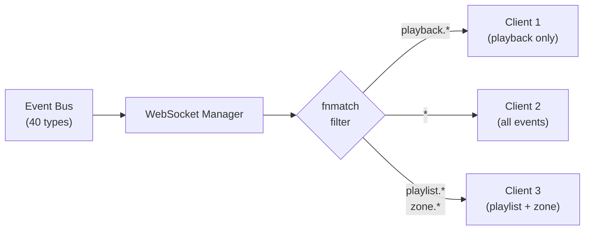
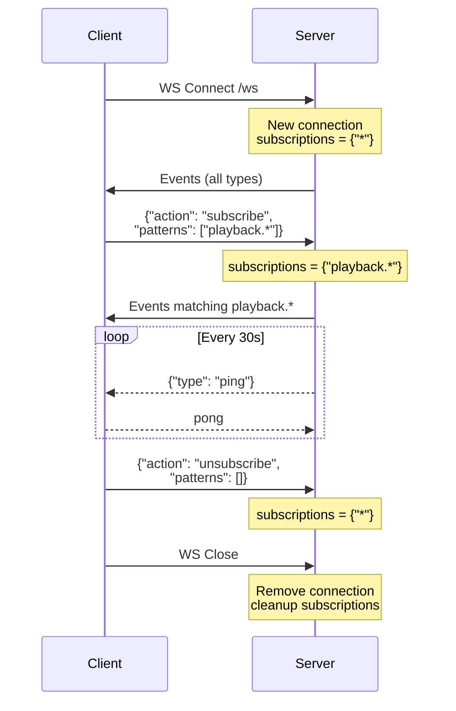

# Event Bus

## Overview

The event bus is the central communication backbone. Components publish events without knowing who subscribes, enabling loose coupling.

## Implementation

- **Pattern**: Async pub/sub
- **Delivery**: In-order, per-subscriber
- **Async**: Events are dispatched via `asyncio.create_task` (non-blocking emit)
- **Thread-safe**: No, single event loop only (by design)
- **Total event types**: 40

## Event Types

| Event | Value | Source | Description |
|-------|-------|--------|-------------|
| **System** | | | |
| `SYSTEM_STARTED` | `system.started` | app | Server fully initialized |
| `SYSTEM_STOPPING` | `system.stopping` | app | Shutdown initiated |
| **Library** | | | |
| `LIBRARY_SCAN_STARTED` | `library.scan.started` | scanner | Library scan begins |
| `LIBRARY_SCAN_PROGRESS` | `library.scan.progress` | scanner | Scan progress update (files scanned, total) |
| `LIBRARY_SCAN_COMPLETED` | `library.scan.completed` | scanner | Scan finished (added/updated/removed counts) |
| `LIBRARY_TRACK_ADDED` | `library.track.added` | scanner | New track discovered |
| `LIBRARY_TRACK_UPDATED` | `library.track.updated` | scanner | Track metadata changed |
| `LIBRARY_TRACK_REMOVED` | `library.track.removed` | scanner | Track file deleted |
| `LIBRARY_ARTWORK_PROGRESS` | `library.artwork.progress` | scanner | Artwork extraction progress update |
| `LIBRARY_ARTWORK_COMPLETED` | `library.artwork.completed` | scanner | Artwork extraction finished |
| **Playback** | | | |
| `PLAYBACK_STARTED` | `playback.started` | player | Track begins playing |
| `PLAYBACK_PAUSED` | `playback.paused` | player | Playback paused |
| `PLAYBACK_RESUMED` | `playback.resumed` | player | Playback resumed |
| `PLAYBACK_STOPPED` | `playback.stopped` | player | Playback stopped |
| `PLAYBACK_TRACK_CHANGED` | `playback.track_changed` | player | Auto-advanced to next track |
| `PLAYBACK_POSITION` | `playback.position` | player | Position update |
| `PLAYBACK_ERROR` | `playback.error` | player | Playback error occurred |
| `PLAYBACK_QUEUE_CHANGED` | `playback.queue_changed` | player | Queue modified |
| **Playlist** | | | |
| `PLAYLIST_CREATED` | `playlist.created` | api | New playlist created |
| `PLAYLIST_UPDATED` | `playlist.updated` | api | Playlist metadata changed |
| `PLAYLIST_DELETED` | `playlist.deleted` | api | Playlist deleted |
| `PLAYLIST_TRACKS_CHANGED` | `playlist.tracks_changed` | api | Tracks added/removed/reordered |
| **Zone** | | | |
| `ZONE_CREATED` | `zone.created` | zone_manager | New zone created |
| `ZONE_DELETED` | `zone.deleted` | zone_manager | Zone removed |
| `ZONE_UPDATED` | `zone.updated` | zone_manager | Zone settings changed |
| `ZONE_GROUPED` | `zone.grouped` | group_manager | Zones grouped for multi-room |
| `ZONE_UNGROUPED` | `zone.ungrouped` | group_manager | Group dissolved |
| `ZONE_VOLUME_CHANGED` | `zone.volume_changed` | player | Volume adjusted |
| **Device** | | | |
| `DEVICE_DISCOVERED` | `device.discovered` | ssdp/mdns | New network device found |
| `DEVICE_LOST` | `device.lost` | ssdp | Device no longer responding |
| `DEVICE_UPDATED` | `device.updated` | ssdp/mdns | Device info changed |
| **Network** | | | |
| `NETWORK_SHARE_DISCOVERED` | `network.share.discovered` | smb/nfs | Network share found |
| `NETWORK_SHARE_LOST` | `network.share.lost` | smb/nfs | Network share no longer available |
| `NETWORK_MOUNT_ADDED` | `network.mount.added` | mount_manager | Share mounted as library source |
| `NETWORK_MOUNT_REMOVED` | `network.mount.removed` | mount_manager | Mount removed |
| `MEDIA_SERVER_DISCOVERED` | `network.media_server.discovered` | ssdp | UPnP/DLNA media server found |
| `MEDIA_SERVER_LOST` | `network.media_server.lost` | ssdp | UPnP/DLNA media server gone |
| **Radio** | | | |
| `RADIO_CREATED` | `radio.created` | api | New radio station created |
| `RADIO_UPDATED` | `radio.updated` | api | Radio station metadata changed |
| `RADIO_DELETED` | `radio.deleted` | api | Radio station deleted |

## Event Structure

```python
@dataclass
class Event:
    type: EventType        # Enum value
    data: dict | None      # Event-specific payload
    source: str            # Component that emitted (e.g., "player", "ssdp")
```

## Usage

### Subscribe to specific events

```python
async def on_track_added(event: Event):
    track = event.data
    logger.info("New track", title=track["title"])

event_bus.on(EventType.LIBRARY_TRACK_ADDED, on_track_added)
```

### Subscribe to all events

```python
async def on_any(event: Event):
    # WebSocket manager uses this to broadcast everything
    await ws_manager.broadcast(event)

event_bus.on_all(on_any)
```

### Emit events

```python
# Blocking (awaits all handlers)
await event_bus.emit(Event(
    type=EventType.PLAYBACK_STARTED,
    data={"zone_id": 1, "track_id": 42},
    source="player",
))

# Non-blocking (fire and forget)
event_bus.emit_nowait(Event(
    type=EventType.PLAYBACK_POSITION,
    data={"zone_id": 1, "position_ms": 12345},
    source="player",
))
```

## Subscriber Map

| Subscriber | Events | Purpose |
|-----------|--------|---------|
| WebSocket Manager | ALL (filtered per client) | Broadcast to connected clients |
| Sync Engine | (polls, doesn't subscribe) | Monitors zone positions |
| Discovery Manager | DEVICE_DISCOVERED | Updates device registry |
| Zone Manager | DEVICE_LOST | Marks outputs unavailable |
| Playlist Routes | PLAYLIST_* | Emits on CRUD operations |

## WebSocket Integration

The WebSocket manager subscribes to all events and forwards them to connected clients. Clients can filter events using subscribe/unsubscribe messages with fnmatch patterns.



### Event Message Format

```json
{
    "type": "playback.started",
    "data": {"zone_id": 1, "track_id": 42, "track_title": "La Nuit Je Mens"},
    "source": "player"
}
```

### Subscribe Protocol

**Subscribe to specific patterns:**
```json
{"action": "subscribe", "patterns": ["playback.*", "zone.*"]}
```

**Unsubscribe (reset to all):**
```json
{"action": "unsubscribe", "patterns": []}
```

### Pattern Examples

| Pattern | Matches |
|---------|---------|
| `*` | All events |
| `playback.*` | `playback.started`, `playback.paused`, `playback.position`, ... |
| `playlist.*` | `playlist.created`, `playlist.updated`, `playlist.deleted`, `playlist.tracks_changed` |
| `zone.*` | `zone.created`, `zone.deleted`, `zone.updated`, `zone.grouped`, ... |
| `library.scan.*` | `library.scan.started`, `library.scan.progress`, `library.scan.completed` |
| `device.*` | `device.discovered`, `device.lost`, `device.updated` |
| `network.*` | `network.share.discovered`, `network.mount.added`, `network.media_server.discovered`, ... |
| `radio.*` | `radio.created`, `radio.updated`, `radio.deleted` |
| `playback.position` | Only `playback.position` (exact match) |

### Heartbeat

- Server sends `{"type": "ping"}` every `WS_HEARTBEAT_INTERVAL` seconds (default 30)
- Client responds with `pong` (text message)
- Set `TUNE_WS_HEARTBEAT_INTERVAL=0` to disable
- Non-JSON client messages are treated as pong (heartbeat response)

### Connection Lifecycle


