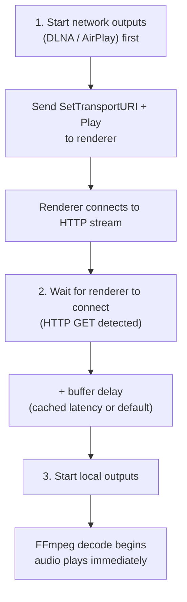
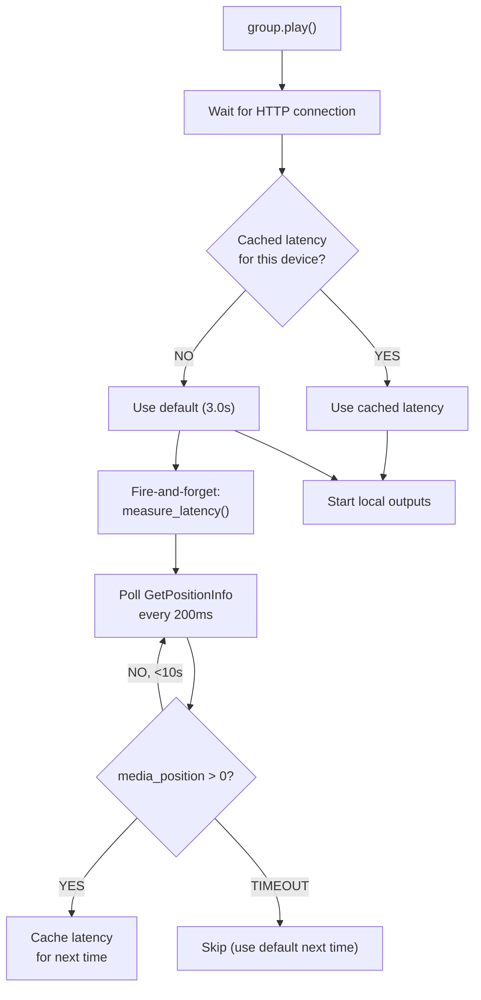
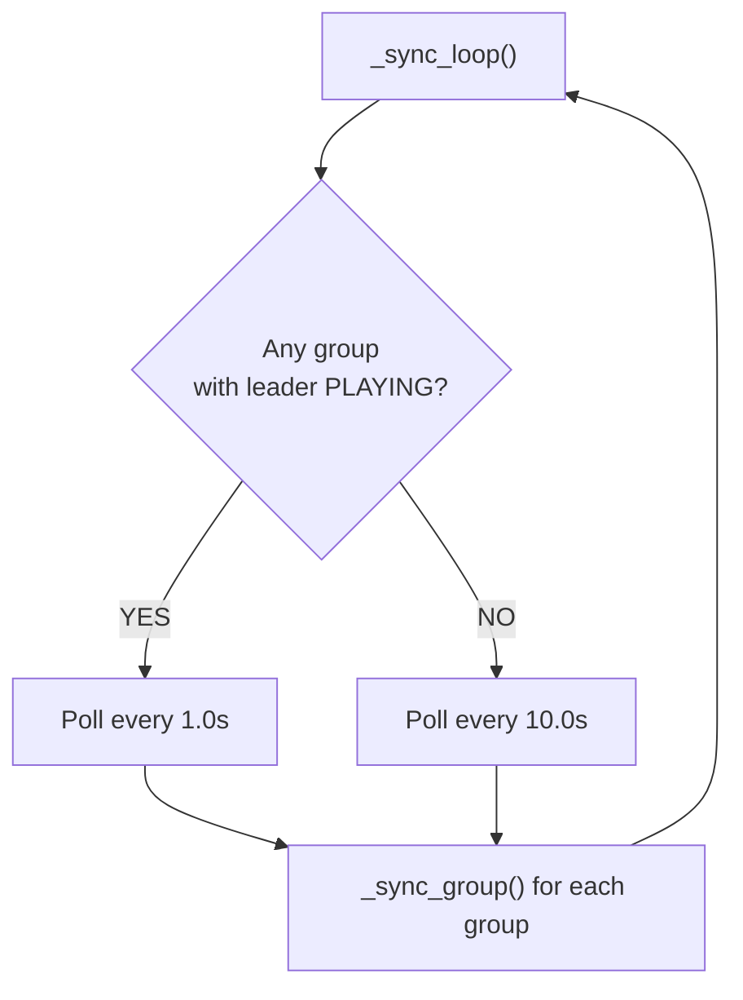
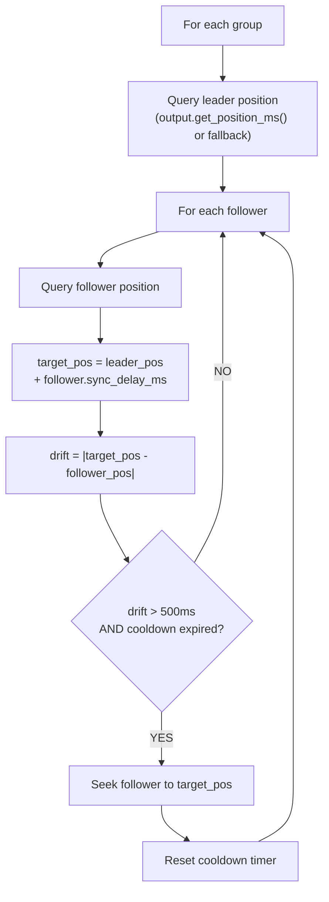
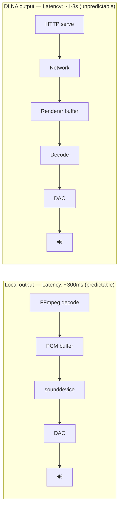

# Multi-Room Playback

## Overview

Zones can be grouped for synchronized multi-room playback. One zone is the **leader** (drives the queue), others are **followers** (mirror playback).

## Grouping

### Create a Group

```bash
POST /api/v1/zones/group
{
    "leader_id": 4,          # DLNA zone (EverSolo DMP-A8)
    "zone_ids": [1, 4]       # Local + DLNA
}
```

### Behavior When Grouped

- **Play/Pause/Stop/Next/Previous** on any zone in the group affects all zones
- The leader's queue is authoritative
- Followers play the same track at the same position (plus per-zone offset)

### Dissolve a Group

```bash
DELETE /api/v1/zones/group/<group-id>
```

Zones return to independent operation.

## Per-Zone Sync Offset

Each zone has a configurable `sync_delay_ms` (default `0`). This allows fine-tuning of synchronization per device:

```bash
# Set a +500ms delay on a zone (follower plays 500ms later than leader)
PUT /api/v1/zones/3
{"sync_delay_ms": 500}

# Set a -200ms offset (follower plays 200ms earlier)
PATCH /api/v1/zones/3
{"sync_delay_ms": -200}
```

The offset is applied during drift correction: `target_pos = leader_pos + follower.sync_delay_ms`.

This is useful when devices have different inherent latencies (e.g., a DLNA renderer vs a local output).

## Synchronized Start

When `group.play()` is called, the startup is staggered to compensate for DLNA buffering latency:



This ensures the DLNA renderer has time to buffer before the local output starts, reducing the perceived delay.

### Timing Diagram

```mermaid
gantt
    title Synchronized Start Timing
    dateFormat X
    axisFormat %L ms

    section DLNA
    SetTransportURI + Play sent        :dlna1, 0, 50
    Renderer HTTP GET (connected)      :dlna2, 50, 50
    Wait buffer delay                  :dlna3, 50, 3000
    Renderer outputs audio (~approx)   :milestone, 3000, 0

    section LOCAL
    FFmpeg decode starts               :local1, 3050, 250
    First PCM samples reach sounddevice :milestone, 3300, 0
```



## Adaptive DLNA Latency

Instead of using a fixed buffer delay, the server measures actual DLNA renderer latency and caches it per device.

### How It Works

1. **First play**: uses `sync_dlna_default_buffer_s` (default 3.0s) as the buffer delay
2. **Background measurement**: after the renderer connects, a fire-and-forget task polls `GetPositionInfo` every 200ms until `media_position > 0`
3. **Latency cached**: the measured time is stored in memory keyed by device name
4. **Subsequent plays**: the cached latency is used instead of the default, providing a more accurate buffer



## Query Position from Outputs

The sync engine queries the actual playback position from each output type, rather than relying solely on the software clock (`time.monotonic()`).

| Output | Method | Fallback |
|--------|--------|----------|
| **DLNA** | `GetPositionInfo` → `media_position` (seconds) | Software clock |
| **AirPlay** | `pyatv.metadata.playing()` → `.position` (seconds) | Software clock |
| **Local** | Elapsed time tracking (`time.monotonic()`) | Always available |

Each output implements `get_position_ms()` returning the position in milliseconds, or `-1` if unavailable.

## Sync Engine

The sync engine runs as a background task with **adaptive polling**: faster when groups are actively playing, slower when idle.

### Configurable Parameters

All parameters are configurable via environment variables (`TUNE_` prefix) or `.env`:

| Setting | Default | Env Variable | Description |
|---------|---------|-------------|-------------|
| `sync_poll_playing_interval` | 1.0s | `TUNE_SYNC_POLL_PLAYING_INTERVAL` | Polling interval when groups are playing |
| `sync_poll_idle_interval` | 10.0s | `TUNE_SYNC_POLL_IDLE_INTERVAL` | Polling interval when no active groups |
| `sync_drift_threshold_ms` | 500ms | `TUNE_SYNC_DRIFT_THRESHOLD_MS` | Correct only if drift exceeds this |
| `sync_correction_cooldown_s` | 15.0s | `TUNE_SYNC_CORRECTION_COOLDOWN_S` | Min time between corrections per follower |
| `sync_dlna_default_buffer_s` | 3.0s | `TUNE_SYNC_DLNA_DEFAULT_BUFFER_S` | Default DLNA buffer delay (before measured) |

### Adaptive Polling



### Correction Mechanism



### Cooldown After Group Play

When a group starts playing, the correction cooldown prevents the sync engine from interfering with the staggered start.

## Limitations

### DLNA Sync Precision

DLNA renderers have inherent latency that varies by device:
- HTTP stream buffering: 0.5-3 seconds (device-dependent)
- Position queries may not be supported or accurate on all devices
- With adaptive latency measurement: precision improves over subsequent plays

Practical sync accuracy: **~200-500ms** with adaptive latency and position queries (improved from ~0.5-2s).

### Why Perfect Sync Is Hard



The fundamental challenge: we control the local output pipeline end-to-end, but DLNA is a black box after we serve the HTTP stream. We don't know when audio actually exits the speakers.

### Comparison with Other Solutions

| Solution | Sync Method | Precision |
|----------|------------|-----------|
| **This server** | Adaptive latency + position query + drift correction | ~200-500ms |
| Roon (RAAT) | Proprietary protocol, clock sync | <1ms |
| Sonos | Custom protocol, NTP sync | <1ms |
| Snapcast | Buffer-based, NTP-synced playback | <5ms |
| DLNA standard | No sync specification | N/A |

For sub-millisecond sync, a custom streaming protocol (like Snapcast's approach) would be needed, bypassing DLNA entirely.

## Future Improvements

1. **Snapcast integration**: Use Snapcast protocol for local network outputs
2. **NTP-based sync**: Synchronize clocks between server and clients
3. **Position feedback loop**: Continuous position tracking with PID controller for smoother corrections
