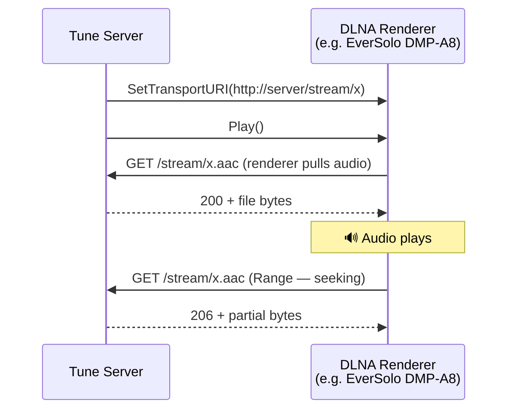
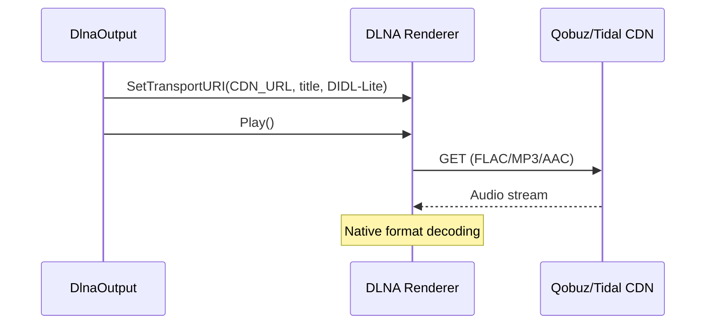
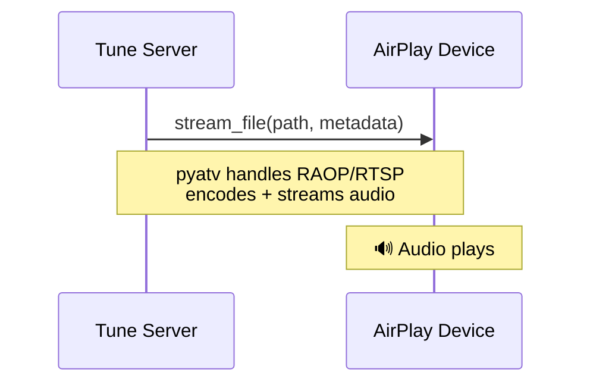
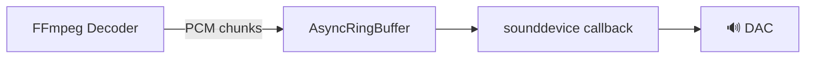

# Output Targets

## OutputTarget Protocol

All outputs implement the same abstract interface:

```python
class OutputTarget(Protocol):
    name: str                              # Display name
    capabilities: AudioCapabilities        # Supported formats
    is_available: bool                     # Device reachable?

    def supports_direct_url(track) -> bool  # Can fetch URL directly?
    async def start(stream_info, track)    # Begin playback
    async def write(data: bytes)           # Feed audio data
    async def flush()                      # Flush buffers
    async def pause()                      # Pause output
    async def resume()                     # Resume output
    async def stop()                       # Stop output
    async def set_volume(volume: float)    # 0.0 - 1.0
    async def close()                      # Release resources
```

The player calls these methods without knowing the output type. This enables adding new output types without modifying the player.

## DLNA Output

### How It Works

DLNA uses a **pull model**: we tell the renderer a URL, and it fetches the audio data via HTTP.



### Components

- **DmrDevice** (async-upnp-client): Controls the renderer via UPnP AVTransport
- **HttpAudioStreamer** (aiohttp): Serves audio files on port 8080
- **DIDL-Lite**: XML metadata sent with the transport URI (title, artist, album)

### Capabilities

DLNA capabilities are built **per device**, not globally. The base set is:

```python
base_formats = {FLAC, WAV, MP3, AAC}
max_sample_rate = 192000
max_bit_depth = 24
```

When the renderer supports native DSD (detected via `GetProtocolInfo` or device name heuristic), `DSD` is added to the format set. This enables bit-perfect DSF/DFF passthrough.

### Native DSD Support

The `DlnaOutput` detects DSD capability via two methods:

1. **GetProtocolInfo**: queries the renderer's `SinkProtocolInfo` for DSD MIME types (`audio/x-dsf`, `audio/x-dff`, `application/x-dsd`)
2. **Device heuristic**: if protocol info is empty (many audiophile devices don't implement it), checks the device name/model against known DSD-capable patterns (Eversolo DMP-A, Lumin, Naim, Cambridge Audio, Linn, Auralic, HEOS, Oppo)

When DSD is supported, DSF files are served via the HTTP streamer with `audio/x-dsf` MIME type. The renderer's DAC decodes DSD natively. When not supported, FFmpeg transcodes to PCM WAV (176.4kHz/24-bit).

### Device Discovery

SSDP multicast discovers `urn:schemas-upnp-org:device:MediaRenderer:1` devices every 30 seconds. For each device, a `DmrDevice` wrapper is created from the device description XML. The server also queries `GetProtocolInfo` to detect supported formats (including DSD).

### Direct URL Passthrough

For streaming service tracks (Qobuz, Tidal), the DLNA output can bypass the local pipeline entirely. The renderer fetches the audio directly from the CDN:



- `supports_direct_url(track)` returns `True` for HTTP(S) URLs with FLAC, MP3, or AAC format
- `write()` becomes a no-op — the renderer pulls data on its own
- The player skips pipeline creation entirely (no FFmpeg subprocess)
- DIDL-Lite metadata includes album art URL, duration, and audio properties

### Gapless Playback

Supported via `SetNextAVTransportURI` — tells the renderer what track comes next before the current one ends. Works with both local files and direct URLs.

## AirPlay Output

### How It Works

Uses pyatv's `stream_file()` which handles RAOP (Remote Audio Output Protocol) internally.



### Components

- **pyatv**: Handles pairing, authentication, RAOP streaming
- No HTTP streamer needed — pyatv reads the file and streams directly

### Capabilities

```python
AIRPLAY_CAPABILITIES = {
    formats: {FLAC, WAV, MP3, AAC, ALAC},
    max_sample_rate: 48000,   # AirPlay 1 limit
    max_bit_depth: 16,
}
```

### Device Discovery

mDNS/Bonjour via `pyatv.scan()` discovers AirPlay devices every 10 seconds.

### Limitations

- AirPlay 1 (RAOP) limited to 44.1/48 kHz, 16-bit
- Some devices may reject RAOP ANNOUNCE (e.g., some EverSolo firmware versions)
- `write()` is a no-op — pyatv handles streaming internally

## Local Output

### How It Works

Uses sounddevice (PortAudio) to write raw PCM directly to the system audio device.



### Components

- **sounddevice**: PortAudio wrapper, callback-based output
- **numpy**: Converts byte buffers to typed arrays for sounddevice

### Capabilities

```python
LOCAL_CAPABILITIES = {
    formats: {WAV},   # Only raw PCM accepted
    max_sample_rate: 384000,
    max_bit_depth: 32,
}
```

All source formats are decoded through FFmpeg to raw PCM. This is mandatory because sounddevice only accepts uncompressed samples.

### Volume Control

Volume is applied by scaling the numpy sample array before writing to sounddevice:

```python
samples = samples * self._volume  # 0.0 to 1.0
```

### Output Device

Uses the system default audio output device. Can be configured via `output_device_id` to select a specific device (e.g., a USB DAC).

## Output Factory Pattern

Outputs are created via factory functions registered on the ZoneManager:

```python
zone_manager.register_output_factory(OutputType.DLNA, create_dlna_output)
zone_manager.register_output_factory(OutputType.AIRPLAY, create_airplay_output)
zone_manager.register_output_factory(OutputType.LOCAL, create_local_output)
```

Each factory:
1. Takes a `device_id` string
2. Looks up the device in the discovery registry
3. Creates and returns an OutputTarget instance
4. Returns `None` if the device isn't available

For DLNA, the factory waits up to 15 seconds for the device to be discovered (handles startup race condition).
