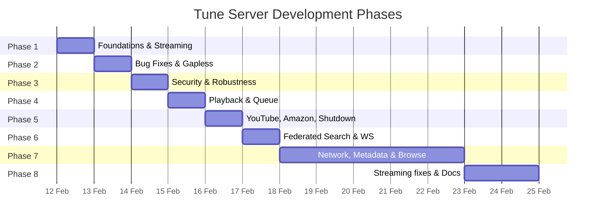
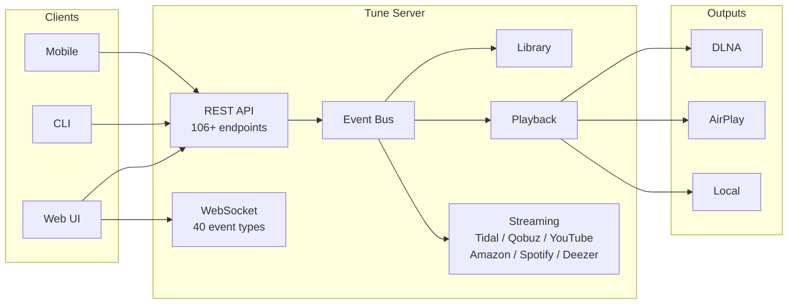

# Tune Server — Project History

## Project Stats

| Metric | Value |
|--------|-------|
| Source modules | 70+ Python files |
| Test files | 33+ Python files |
| Source LOC | ~20,900 |
| Test LOC | ~8,100 |
| Total tests | 572+ |
| API endpoints | 106+ |
| Event types | 40 |
| Streaming services | 6 (Tidal, Qobuz, YouTube Music, Amazon Music, Spotify, Deezer) |
| Database tables | 9 + 3 FTS virtual tables |
| Git commits | 64+ |

## Development Timeline

| Phase | Date | Objective | Key Commits | Tests Added |
|-------|------|-----------|-------------|-------------|
| [Phase 1](phase1.md) | 12 fév. 2026 | Foundations, streaming playback, core architecture | `771117f` → `df84eb8` | 172 |
| [Phase 2](phase2.md) | 12 fév. 2026 | Bug fixes, gapless playback, playlist API | `a5af25c` → `57562cb` | 151 |
| [Phase 3](phase3.md) | 12-13 fév. 2026 | Security hardening, connection resilience | `727fc1a` | ~50 |
| [Phase 4](phase4.md) | 13 fév. 2026 | Playback robustness, queue persistence | `cf734f6` | ~60 |
| [Phase 5](phase5.md) | 13 fév. 2026 | YouTube/Amazon Music, typed responses, graceful shutdown | `aa5e64b` | ~70 |
| [Phase 6](phase6.md) | 13 fév. 2026 | Federated search, WebSocket filtering, playlist sync | `93bcae1` → `c5f2133` | ~70 |
| Phase 7 | 14-28 fév. 2026 | Network shares, metadata editing, directory browsing, DLNA MediaServers, web client | multiple | — |
| Phase 8 | 1 mars 2026 | DLNA direct URL passthrough (Qobuz/Tidal fix), documentation update | — | — |

## Features by Phase

### Phase 1 — Foundations & Streaming Playback
- Full music server architecture: FastAPI REST API, SQLite with FTS5, async event bus
- Audio pipeline with FFmpeg decode/passthrough, DLNA/AirPlay/local outputs
- Multi-room zone management with grouping and sync
- Library scanning with metadata extraction (mutagen) and filesystem watcher
- Tidal and Qobuz streaming integration with OAuth flows

### Phase 2 — Bug Fixes & Gapless Playback
- Gapless playback engine for seamless track transitions
- Playlist CRUD API with track management
- Metadata editing endpoints (PUT/DELETE on tracks, albums, artists)
- Album artwork serving with cache
- Scanner race condition fix, queue/volume persistence
- Streaming playback: URL pipeline support, browse endpoints, auth persistence

### Phase 3 — Security & Robustness
- API key authentication (`X-API-Key` header)
- CORS configuration with configurable origins
- Input validation hardening (path traversal prevention, offset/limit bounds)
- Connection resilience for DLNA/AirPlay outputs
- Thread safety improvements across components

### Phase 4 — Playback Robustness & Queue Persistence
- Play queue persisted to SQLite (survives restarts)
- Streaming track queue support (source/source_id in queue)
- Queue completeness: move, jump, remove operations
- Playback error recovery with automatic skip-to-next
- Volume persistence per zone

### Phase 5 — YouTube Music & Amazon Music
- YouTube Music integration (ytmusicapi + yt-dlp for URL extraction)
- Amazon Music integration (undocumented API, device OAuth)
- Streaming service registry with dynamic enable/disable
- Typed API responses (Pydantic response models)
- Graceful shutdown with `_safe_stop` and per-component timeouts
- Auth restore on startup for all streaming services

### Phase 6 — Federated Search, WebSocket Filtering & Polish
- Federated search across local library + all streaming services (`GET /search`)
- WebSocket subscribe/unsubscribe with fnmatch pattern filtering
- Playlist event synchronization (PLAYLIST_CREATED/UPDATED/DELETED/TRACKS_CHANGED)
- System config and scan status endpoints
- Thread safety fixes, race condition patches, null guards

### Phase 7 — Network, Metadata & Directory Browsing
- Network share discovery (SMB/NFS via mDNS) with mount management
- DLNA MediaServer browsing (ContentDirectory)
- Library browse-by-directory endpoints
- Metadata editing (PUT/DELETE on tracks, albums, artists)
- Album artwork upload, rescan, batch rescan
- Metadata completeness stats endpoint
- Duplicate album merging
- Streaming service featured content sections
- Streaming service disconnect endpoint
- Embedded web client (Svelte SPA) served from API port
- Debian package bundling with web client

### Phase 8 — Streaming Audio Fix & Documentation
- DLNA direct URL passthrough for streaming services (FLAC/MP3/AAC)
  - Fixes 24-bit WAV noise on DLNA renderers by letting them fetch FLAC directly from CDN
  - No pipeline, no FFmpeg process — renderer pulls from streaming service URL
- Comprehensive documentation update (85+ endpoints, architecture diagrams)

## Architecture Overview

## Test Architecture

| Test File | Module Covered | Tests |
|-----------|---------------|-------|
| `test_repository.py` | Database repositories | ~30 |
| `test_event_bus.py` | Event bus pub/sub | ~15 |
| `test_player.py` | Player state machine | ~20 |
| `test_queue.py` | Play queue | ~15 |
| `test_buffer.py` | Audio ring buffer | ~10 |
| `test_formats.py` | Audio format detection | ~10 |
| `test_scanner.py` | Library scanner | ~15 |
| `test_metadata_reader.py` | Metadata extraction | ~10 |
| `test_models.py` | Pydantic models | ~10 |
| `test_api_library.py` | Library API routes | ~15 |
| `test_api_playback.py` | Playback API routes | ~15 |
| `test_api_playlists.py` | Playlist API routes | ~15 |
| `test_api_zones.py` | Zone API routes | ~15 |
| `test_api_system.py` | System API routes | ~10 |
| `test_websocket.py` | WebSocket manager | ~15 |
| `test_gapless.py` | Gapless playback | ~10 |
| `test_artwork.py` | Artwork handling | ~10 |
| `test_discovery.py` | Device discovery | ~10 |
| `test_http_streamer.py` | HTTP audio streaming | ~10 |
| `test_streaming_playback.py` | Streaming integration | ~10 |
| `test_stream_cache.py` | URL cache | ~10 |
| `test_sync_engine.py` | Zone synchronization | ~10 |
| `test_zone_*.py` | Zone management | ~25 |
| `test_phase2.py` | Phase 2 integration | 151 |
| `test_phase3.py` | Phase 3 security | ~50 |
| `test_phase4.py` | Phase 4 playback | ~60 |
| `test_phase5.py` | Phase 5 streaming | ~70 |
| `test_phase6.py` | Phase 6 features | ~70 |

## Current State & Technical Debt

### Strengths
- High test coverage (~1:1 test-to-source ratio)
- Clean async architecture with event-driven communication
- Comprehensive streaming service abstraction (4 services, same interface)
- Full playlist management with real-time sync events
- Robust error handling with graceful degradation

### Known Debt
- YouTube Music URL extraction depends on `yt-dlp` (fragile, breaks with YouTube changes)
- Amazon Music uses undocumented API (no official SDK)
- No authentication beyond optional API key (no user accounts, no OAuth for clients)
- No rate limiting on API endpoints
- Single-node only (no clustering or distributed playback coordination)
- No automated CI/CD pipeline
- Artwork cache has no size limit or eviction policy
- mDNS/SSDP discovery runs continuously even when no zones use network outputs
