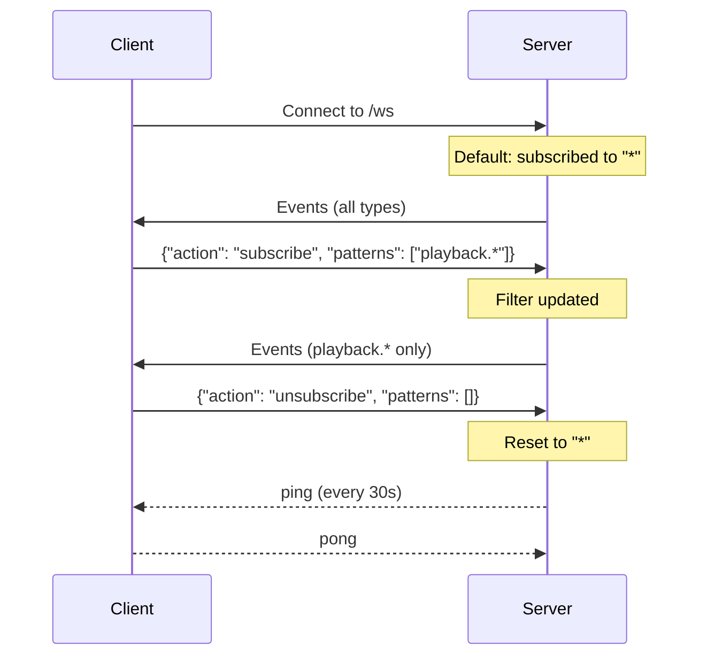

# Phase 6 — Federated Search, WebSocket Filtering & Polish

**Date:** 13 février 2026
**Commits:** `93bcae1` → `c5f2133` (3 commits)
**Tests added:** ~70

## Objectives

- Implement federated search across local library and all streaming services
- Add WebSocket subscribe/unsubscribe with fnmatch pattern filtering
- Emit playlist events for real-time sync
- Add system configuration and scan status endpoints
- Final round of bug fixes: thread safety, race conditions, null guards

## Changes

### Federated Search (`api/routes/search.py`)

**Endpoint:** `GET /api/v1/search?q=query&limit=20&sources=local,tidal,youtube`

- Searches local library + all authenticated streaming services in parallel
- `sources` parameter: comma-separated list to filter which sources to query
- Uses `asyncio.gather(return_exceptions=True)` for fault-tolerant parallel execution
- Failed services logged as warning, other results still returned
- Response structure:

```json
{
    "local": {"tracks": [], "albums": [], "artists": []},
    "services": {
        "tidal": {"tracks": [], "albums": [], "artists": []},
        "youtube": {"tracks": [], "albums": [], "artists": []}
    }
}
```

### WebSocket Filtering (`api/websocket.py`)

**Protocol:**



- Clients subscribe to event patterns using fnmatch syntax
- Default subscription: `{"*"}` (all events)
- Pattern examples: `"playback.*"`, `"zone.1.*"`, `"playlist.*"`
- Multiple patterns per subscription (OR logic)
- Heartbeat: server sends `{"type": "ping"}` every N seconds (`TUNE_WS_HEARTBEAT_INTERVAL`)

### Playlist Event Sync
- 4 new event types:
  - `PLAYLIST_CREATED` ("playlist.created") — Emitted on playlist creation
  - `PLAYLIST_UPDATED` ("playlist.updated") — Emitted on name/description change
  - `PLAYLIST_DELETED` ("playlist.deleted") — Emitted on deletion
  - `PLAYLIST_TRACKS_CHANGED` ("playlist.tracks_changed") — Emitted on add/remove/reorder
- Events include playlist ID and relevant data for client-side cache invalidation
- Total event types: 24 → 28

### System Endpoints
- `GET /system/config` — Returns current server configuration (sanitized, no secrets)
- `GET /system/scan/status` — Returns scan state (idle/scanning, progress percentage, counts)
- `GET /system/stats` — Updated to include zone count and device count

### Bug Fixes (commits `93bcae1`, `e89623b`)
- Thread safety: event bus subscriber list copied during iteration
- Race condition: WebSocket connection cleanup during broadcast
- Null guards: optional fields handled in streaming service responses
- API correctness: proper HTTP status codes (201 Created, 204 No Content)
- Security: additional input validation on streaming search params

## Technical Decisions

| Decision | Rationale |
|----------|-----------|
| Federated search with `asyncio.gather` | Parallel execution minimizes latency; exceptions don't propagate |
| fnmatch for WS patterns | Shell-style globs are intuitive; `fnmatch` is in stdlib |
| Default subscribe to `"*"` | Backward compatible; existing clients get all events without changes |
| Playlist events (not generic CRUD) | Specific event types allow targeted subscriptions (e.g., `"playlist.*"`) |
| Heartbeat configurable / disableable | Some clients handle their own keep-alive; 0 disables |

## Files Created/Modified

| File | Change |
|------|--------|
| `api/routes/search.py` | **Created** — Federated search endpoint |
| `api/websocket.py` | Added subscribe/unsubscribe protocol, fnmatch filtering, heartbeat |
| `api/routes/playlists.py` | Added event emissions (PLAYLIST_CREATED/UPDATED/DELETED/TRACKS_CHANGED) |
| `api/routes/system.py` | Added `/config`, `/scan/status`; updated `/stats` response |
| `event_bus.py` | Added 4 playlist events + `LIBRARY_SCAN_PROGRESS` + `ZONE_UPDATED` (24 → 28 types) |
| `models.py` | `FederatedSearchResult`, `SystemConfigResponse`, `ScanStatusResponse` |
| `config.py` | `TUNE_WS_HEARTBEAT_INTERVAL` |
| `api/main.py` | Mounted search router |

## Tests

- `test_phase6.py` — ~70 tests covering:
  - Federated search: local only, local + services, service failure handling
  - Source filtering: `sources=local,tidal` excludes other services
  - WebSocket subscribe: single pattern, multiple patterns, wildcard
  - WebSocket unsubscribe: reset to default
  - fnmatch pattern matching: `"playback.*"`, `"zone.1.*"`, exact match
  - Heartbeat: ping/pong exchange
  - Playlist events: create/update/delete/tracks_changed emissions
  - System config: response fields, secret sanitization
  - Scan status: idle state, scanning state with progress

## Commits

| Hash | Message |
|------|---------|
| `93bcae1` | Fix security, thread safety, and API hardening issues from code review |
| `e89623b` | Fix thread safety, race conditions, null guards, and API correctness |
| `c5f2133` | Add federated search, WebSocket filtering, playlist sync events, and polish |
