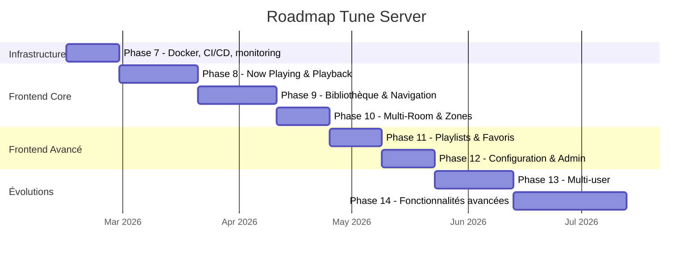

# Tune Server — Roadmap

## Constat

Le backend est solide (60+ endpoints, 572 tests, 4 services streaming, multi-room). Mais le projet n'a **aucune interface utilisateur** — tout se fait en `curl`. Pour être réellement utilisable au quotidien, il faut au minimum un frontend web.

---

## Vue d'ensemble



## Priorités

| Priorité | Phase | Description |
|----------|-------|-------------|
| Critique | Phase 8 | Now Playing — sans ça, le projet n'est pas utilisable |
| Critique | Phase 9 | Bibliothèque — naviguer et lancer la musique |
| Important | Phase 10 | Multi-room — la promesse centrale du projet |
| Important | Phase 7 | Docker + CI — avant de distribuer |
| Utile | Phase 11 | Playlists & favoris |
| Utile | Phase 12 | Admin UI |
| Later | Phase 13 | Multi-user |
| Later | Phase 14 | Fonctionnalités avancées |

---

## Phase 7 — Infrastructure & DevOps

Consolider la base avant d'attaquer le frontend.

### Objectifs
- **Docker** — `Dockerfile` + `docker-compose.yml` (serveur + volumes pour DB et artwork cache)
- **CI/CD** — GitHub Actions : lint (ruff), tests (pytest), build Docker image
- **Rate limiting** — Middleware FastAPI pour protéger les endpoints publics
- **Healthcheck amélioré** — Vérifier DB, FFmpeg, services streaming, discovery
- **Métriques** — Endpoint Prometheus `/metrics` (tracks jouées, latence API, connexions WS)
- **Logging structuré** — Correlation ID par requête pour le debugging

### Livrables
- `Dockerfile` + `docker-compose.yml`
- `.github/workflows/ci.yml`
- Middleware rate limiting
- Endpoint `/metrics`

---

## Phase 8 — Web UI : Now Playing & Playback

Le coeur de l'expérience — contrôler la musique.

### Objectifs
- **Now Playing** — Artwork grand format, titre/artiste/album, barre de progression, contrôles play/pause/next/prev/seek
- **Queue** — Liste des pistes à venir, drag & drop pour réordonner, supprimer
- **Volume** — Slider par zone
- **WebSocket** — Connexion temps réel pour sync instantanée (subscribe `playback.*`)
- **Responsive** — Utilisable sur mobile (tablette murale, téléphone)

### Stack frontend
| Option | Pour | Contre |
|--------|------|--------|
| **React + Next.js** | Écosystème immense, SSR, composants audio matures | Lourd, complexité |
| **Vue + Nuxt** | Plus léger, API intuitive, bon pour apps interactives | Moins de libs audio |
| **Svelte + SvelteKit** | Ultra-performant, bundle minimal, réactivité native | Écosystème plus petit |
| **HTMX + Jinja** | Zéro build, servi par FastAPI directement | Limité pour drag & drop, WS |

**Recommandation** : Vue 3 + Nuxt 3 ou Svelte + SvelteKit — le projet est une app interactive (WebSocket, drag & drop, temps réel) sans besoin du poids de React. Svelte serait le plus performant pour du temps réel audio.

### Maquette

```
┌─────────────────────────────────────────────┐
│  Tune Server                    🔍  ⚙️     │
├─────────────────────────────────────────────┤
│                                             │
│           ┌───────────────┐                 │
│           │               │                 │
│           │   ARTWORK     │                 │
│           │   400x400     │                 │
│           │               │                 │
│           └───────────────┘                 │
│                                             │
│         La Nuit Je Mens                     │
│         Alain Bashung                       │
│         Fantaisie Militaire                 │
│                                             │
│    2:34 ━━━━━━━━━━●━━━━━━━━━━━━ 4:24       │
│                                             │
│         ⏮   ▶️   ⏭      🔀  🔁           │
│                                             │
│    🔊 ━━━━━━━━━━━━━●━━━━━━━ 70%           │
│                                             │
├─────────────────────────────────────────────┤
│  Queue (12 tracks)                          │
│  ▸ 2. Fantaisie Militaire    3:52          │
│    3. À Perte de Vue         4:10          │
│    4. Les Mots Bleus         3:44          │
└─────────────────────────────────────────────┘
```

---

## Phase 9 — Web UI : Bibliothèque & Navigation

Explorer et lancer la musique.

### Objectifs
- **Browse** — Albums (grille avec artwork), artistes, pistes
- **Détail album** — Tracklist, artwork, année, genre, bouton "Play all"
- **Détail artiste** — Discographie, top tracks
- **Recherche** — Barre globale, recherche fédérée (locale + streaming)
- **Filtres** — Par genre, année, format (hi-res), source (local/tidal/youtube...)
- **Performance** — Artwork lazy loading, virtualisation de grille (grosses bibliothèques)

### Maquette navigation

```
┌──────────────────────────────────────────────┐
│  🔍 Search...                    Albums ▾    │
├──────────────────────────────────────────────┤
│                                              │
│  ┌──────┐  ┌──────┐  ┌──────┐  ┌──────┐    │
│  │ art  │  │ art  │  │ art  │  │ art  │    │
│  │      │  │      │  │      │  │      │    │
│  └──────┘  └──────┘  └──────┘  └──────┘    │
│  Album 1    Album 2    Album 3    Album 4    │
│  Artist A   Artist B   Artist A   Artist C   │
│                                              │
│  ┌──────┐  ┌──────┐  ┌──────┐  ┌──────┐    │
│  │ art  │  │ art  │  │ art  │  │ art  │    │
│  │      │  │      │  │      │  │      │    │
│  └──────┘  └──────┘  └──────┘  └──────┘    │
│  Album 5    Album 6    Album 7    Album 8    │
│  Artist D   Artist A   Artist E   Artist F   │
│                                              │
├──────────────────────────────────────────────┤
│  ▶ Now Playing: La Nuit Je Mens — Bashung    │
└──────────────────────────────────────────────┘
```

---

## Phase 10 — Web UI : Multi-Room & Zones

Piloter toute la maison.

### Objectifs
- **Vue zones** — Toutes les zones avec état (playing/paused/stopped), artwork miniature, volume
- **Groupement** — Drag & drop pour grouper/dégrouper des zones
- **Contrôle par zone** — Chaque zone a ses contrôles indépendants
- **Découverte** — Voir les appareils réseau, créer une zone en un clic
- **Synchronisation** — Indicateur visuel de sync entre zones groupées

### Maquette multi-room

```
┌──────────────────────────────────────────────┐
│  Zones                              + New    │
├──────────────────────────────────────────────┤
│                                              │
│  ┌─ Groupe "Rez-de-chaussée" ─────────────┐ │
│  │                                         │ │
│  │  🔊 Salon (DLNA)        ▶ Bashung      │ │
│  │     ━━━━━━━━●━━━ 70%      2:34/4:24    │ │
│  │                                         │ │
│  │  🔊 Cuisine (AirPlay)   ▶ Bashung      │ │
│  │     ━━━━━━━━●━━━ 50%      2:34/4:24    │ │
│  │                                         │ │
│  └─────────────────────────────────────────┘ │
│                                              │
│  🔊 Bureau (Local)          ⏸ Miles Davis    │
│     ━━━━━●━━━━━━━ 45%        1:20/6:52      │
│                                              │
│  🔊 Chambre (DLNA)          ⏹ Stopped       │
│     ━━━━━━━━━━━━━ 0%                        │
│                                              │
├──────────────────────────────────────────────┤
│  Appareils détectés (3)                      │
│  📱 EverSolo DMP-A8 (DLNA)    [Créer zone]  │
│  📱 HomePod Mini (AirPlay)     [Créer zone]  │
│  📱 Denon AVR-X3700 (DLNA)    [Créer zone]  │
└──────────────────────────────────────────────┘
```

---

## Phase 11 — Web UI : Playlists & Favoris

Organiser sa musique.

### Objectifs
- **Playlists** — Créer, éditer, supprimer, réordonner (drag & drop)
- **Favoris** — Système coeur/étoile sur tracks, albums, artistes
- **Smart playlists** — Règles automatiques (genre = jazz, année > 2020, format = flac)
- **Historique** — "Récemment écouté", "Récemment ajouté"
- **Import/Export** — M3U, export vers services streaming

### Backend requis
- Nouveau modèle `favorites` (table DB)
- Nouveau modèle `smart_playlists` (règles JSON)
- Endpoint historique d'écoute (`play_history` table)
- Parser/writer M3U

---

## Phase 12 — Web UI : Configuration & Admin

Administrer le serveur depuis le navigateur.

### Objectifs
- **Bibliothèque** — Gérer les dossiers scannés, lancer un scan, voir la progression temps réel
- **Services streaming** — Activer/désactiver, lancer l'authentification OAuth depuis l'UI
- **Réseau** — Voir les appareils découverts, forcer un re-scan SSDP/mDNS
- **Audio** — Configurer format de sortie, sample rate max, bit depth
- **Sécurité** — Gérer l'API key, configurer CORS
- **Logs** — Visualisation temps réel des logs serveur (WebSocket)
- **Système** — Stats, santé, version, redémarrage

### Backend requis
- Endpoint `PUT /system/config` (modification à chaud)
- Endpoint logs WebSocket (subscribe `system.log`)
- Endpoint restart

---

## Phase 13 — Comptes utilisateurs & Multi-user

Pour un usage familial.

### Objectifs
- **Authentification** — Login/password ou PIN par utilisateur
- **Profils** — Chaque utilisateur a ses playlists, favoris, historique
- **Permissions** — Admin vs utilisateur standard
- **Sessions** — Chaque utilisateur contrôle indépendamment une zone
- **OAuth client** — Login via Google/Apple (optionnel)

### Backend requis
- Table `users` + `sessions`
- Middleware JWT (remplace l'API key simple)
- Foreign keys utilisateur sur playlists, favoris, historique
- Gestion des permissions par rôle

---

## Phase 14 — Fonctionnalités avancées

Le polish final.

### Objectifs
- **Scrobbling** — Last.fm, ListenBrainz
- **Paroles** — Affichage synchronisé (LRC) via API externe
- **Égaliseur / DSP** — EQ paramétrique, normalisation de volume (ReplayGain)
- **Radio mode** — Lecture infinie basée sur artiste/genre/ambiance
- **Chromecast** — Sortie audio supplémentaire
- **Recommandations** — "Si vous aimez X, essayez Y" (ListenBrainz, Last.fm similar)
- **Podcasts** — Gestion de flux RSS audio
- **Backup/Restore** — Export/import de toute la configuration + playlists + favoris

---

## Choix technologique frontend — Décision à prendre

| Critère | React + Next.js | Vue + Nuxt | Svelte + SvelteKit |
|---------|----------------|------------|-------------------|
| Performance runtime | Bonne | Bonne | Excellente |
| Taille bundle | ~80 KB | ~40 KB | ~15 KB |
| WebSocket / temps réel | Mature | Bon | Excellent (stores réactifs) |
| Drag & drop | react-dnd, dnd-kit | vuedraggable | svelte-dnd-action |
| Courbe d'apprentissage | Moyenne | Facile | Facile |
| Écosystème composants | Immense | Grand | Modeste |
| SSR / SEO | Excellent | Excellent | Bon |

**Recommandation** : Svelte + SvelteKit pour la performance temps réel et la légèreté du bundle, ou Vue + Nuxt pour un écosystème plus mature. React est surdimensionné pour ce type d'application.
